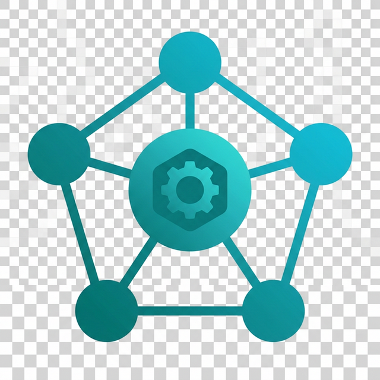
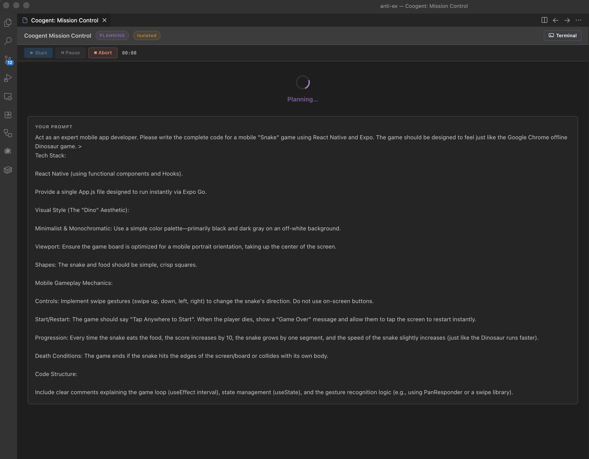
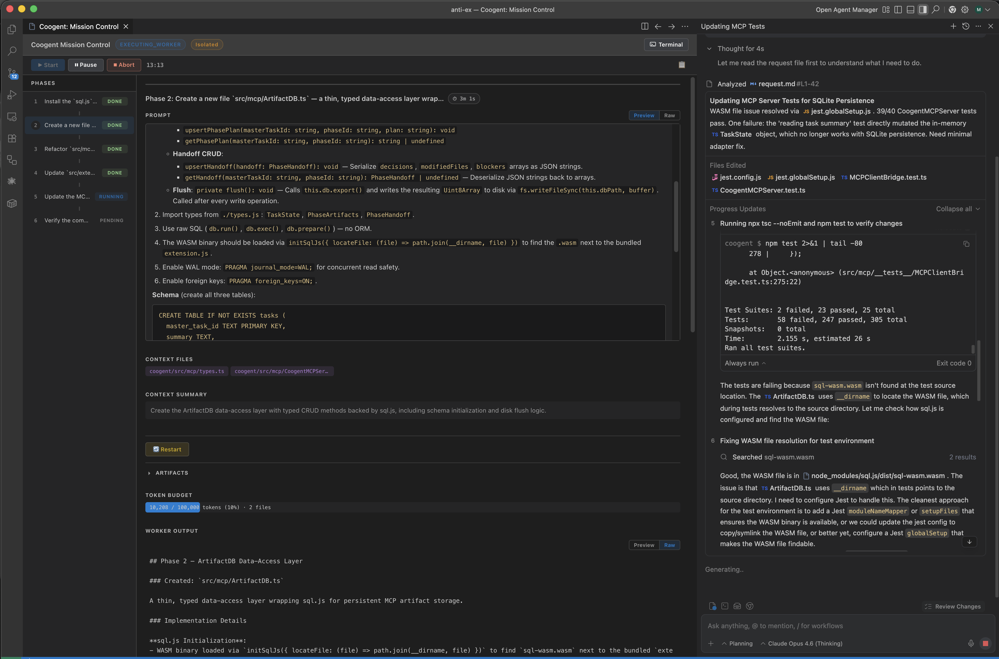

# Coogent — Multi-Agent Engine

<p align="center">
  
</p>

<p align="center">
  <strong>Context Diffusion engine for Antigravity IDE</strong><br/>
  Break massive implementation plans into isolated, zero-context micro-tasks executed by ephemeral AI agents.
</p>

<p align="center">
  <a href="#installation">Installation</a> •
  <a href="#how-it-works">How It Works</a> •
  <a href="#features">Features</a> •
  <a href="docs/site-map.md">Documentation</a> •
  <a href="CONTRIBUTING.md">Contributing</a>
</p>

---

## The Problem

AI coding assistants get worse the longer you use them. As conversation history grows, the model loses focus, forgets earlier decisions, and starts hallucinating — a phenomenon called **Context Collapse**. The bigger the task, the more likely you'll end up with broken code and wasted API calls.

## The Solution

Coogent takes a different approach: instead of keeping one long conversation, it **breaks your task into small, isolated phases** and gives each one to a fresh AI agent that knows only what it needs.

1. **You describe what you want** — "Refactor auth to use JWT", "Add dark mode", "Migrate the database schema"
2. **Coogent plans the work** — An AI planner scans your codebase and decomposes the task into a sequence of micro-phases, each with its own file scope and success criteria
3. **Each phase runs in isolation** — A fresh agent receives *only* the files it needs, executes its task, and hands off its results
4. **Everything is tracked** — Changes are checkpointed to Git branches, outputs stream in real-time, failures retry automatically

No context drift. No hallucinations from stale history. No single 200K-token conversation praying the model doesn't lose the thread.

## How It Works

```
You: "Refactor the authentication module to use JWT"
         │
         ▼
   ┌─────────────┐     ┌──────────────────────────────────────┐
   │   Planner   │────►│ Phase 1: Create JWT utility module    │
   │             │     │ Phase 2: Update auth middleware       │
   │  Scans your │     │ Phase 3: Migrate session endpoints    │
   │  codebase   │     │ Phase 4: Add refresh token rotation   │
   └─────────────┘     │ Phase 5: Update tests                 │
                       └──────────┬───────────────────────────┘
                                  │
                    ┌─────────────┼─────────────┐
                    ▼             ▼             ▼
              ┌──────────┐ ┌──────────┐ ┌──────────┐
              │ Worker 1 │ │ Worker 2 │ │ Worker 3 │  (parallel)
              │ 3 files  │ │ 5 files  │ │ 2 files  │
              └──────────┘ └──────────┘ └──────────┘
                    │             │             │
                    └─────────────┼─────────────┘
                                  ▼
                        ┌──────────────┐
                        │ Consolidated │
                        │    Report    │
                        └──────────────┘
```

## Features

- **Plan → Review → Execute** — AI generates a phased plan; you review and approve before anything runs
- **Parallel Execution** — Independent phases run concurrently (up to 4 workers)
- **Live Dashboard** — Mission Control UI shows real-time output, phase status, and plan details
- **Git Safety** — Automatic sandbox branches keep changes isolated from your working tree
- **Self-Healing** — Failed phases retry automatically with error feedback injected into the next attempt
- **Crash Recovery** — If the IDE crashes mid-execution, Coogent picks up where it left off
- **SQLite Persistence** — Session artifacts stored in a durable SQLite database (via `sql.js` WASM) for cross-session access
- **Secrets Detection** — Automatic scanning for API keys, private keys, and `.env` patterns before injecting files into AI workers
- **Token Budgeting** — Prevents expensive failures by checking context size *before* calling the API
- **post-Execution Reports** — Aggregated summary of all decisions and changes across phases
- **Specialized Worker Library** — Skill-based routing assigns domain-expert workers (frontend, backend, QA, etc.) to each phase using Jaccard similarity matching
- **Custom Worker Profiles** — Define project-specific worker profiles in `.coogent/workers.json` with custom system prompts and skill tags
- **Multi-Root Workspace Support** — Works across all open workspace folders with cross-root file resolution, multi-repo Git sandboxing, and extension-managed state storage
- **MCP Prompts** — 5 discoverable prompt templates (`plan_repo_task`, `review_generated_runbook`, `repair_failed_phase`, `consolidate_session`, `architecture_review_workspace`) for MCP client integration
- **MCP Sampling** — Feature-gated LLM inference via MCP Sampling protocol for review and summarization workflows
- **Database Backup & Recovery** — Periodic ArtifactDB snapshots with atomic writes and automatic rotation
- **Multi-Window Safety** — Concurrent Antigravity windows share a global SQLite database with a cooperative reload-before-write merge strategy
- **Workspace Tenanting** — Deterministic workspace identity enables per-workspace data isolation in a shared global database

## Screenshots

<p align="center">
  <br/>
  <em>Mission Control during the Planning phase — the AI planner decomposes your prompt into executable phases.</em>
</p>

<p align="center">
  <br/>
  <em>Mission Control during Execution — parallel workers stream output while the AI agent resolves issues in real-time.</em>
</p>

## Installation

### Prerequisites

- [Antigravity IDE](https://antigravity.dev) (VS Code ≥ 1.85) — Coogent requires Antigravity IDE's built-in LLM access via the `vscode.lm` API for AI planning and worker execution
- Node.js 18+
- Git

### From VSIX

```bash
# Build the VSIX package first — always build from master
cd coogent
git checkout master
git pull origin master
npm install
npm run prepackage    # Minified extension host + webview build
npm run package       # Creates coogent-<version>.vsix
```

Then install in your IDE:

```
Cmd+Shift+P → "Extensions: Install from VSIX…" → select the generated .vsix file
```

### From Source

```bash
git clone https://github.com/lehoa1806/coogent.git
cd coogent
npm install
npm run build
```

Then press **F5** to launch the Extension Development Host.

## Quick Start

1. **Open Mission Control** — `Cmd+Shift+P` → `Coogent: Open Mission Control`
2. **Enter your objective** — Describe what you want to build or change
3. **Review the plan** — Read the AI-generated phases, approve or regenerate
4. **Watch it execute** — Each phase streams output in real-time
5. **Review the results** — Check the consolidated report and Git diff

## Configuration

All settings live under `coogent.*` in VS Code Settings:

| Setting | Default | Description |
|---|---|---|
| `tokenLimit` | `100,000` | Max tokens per phase context |
| `workerTimeoutMs` | `900,000` | Worker timeout (15 min) |
| `maxRetries` | `3` | Auto-retry attempts per phase |
| `maxConcurrentWorkers` | `4` | Parallel worker limit |
| `contextBudgetTokens` | `150,000` | Token budget for context pack assembly |
| `conversationMode` | `isolated` | Worker mode: `isolated`, `continuous`, `smart-switch` |
| `logLevel` | `info` | Log verbosity (`trace` through `off`) |

> See [user-guide.md](docs/user-guide.md#configuration) for all 18 settings including security flags, encryption, and sampling.

## Documentation

See [docs/site-map.md](docs/site-map.md) for the full documentation index, including:

- [Architecture & Technical Design](docs/architecture.md)
- [User Guide](docs/user-guide.md)
- [Developer & Contributor Guide](docs/developer-guide.md)
- [API & Integration Reference](docs/api-reference.md)
- [MCP Setup Guide](docs/mcp-setup.md)
- [Deployment & Operations](docs/operations.md)
- [Changelog](CHANGELOG.md)

## License

[MIT](LICENSE)
