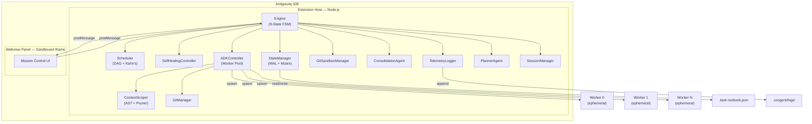
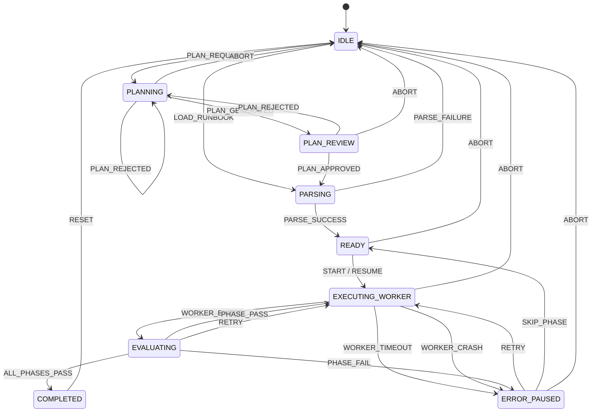
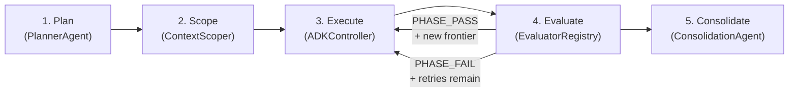
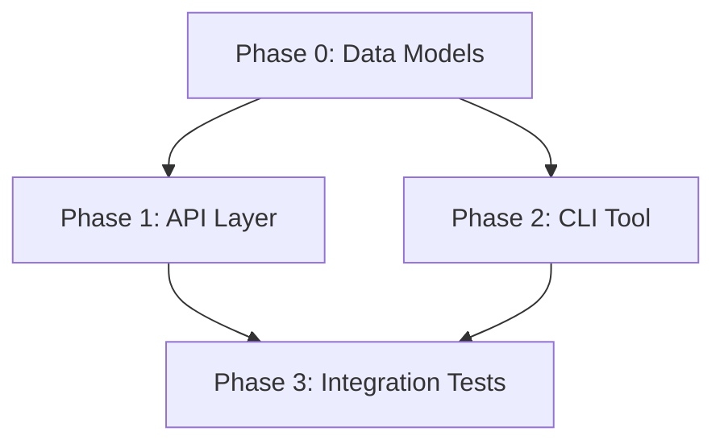
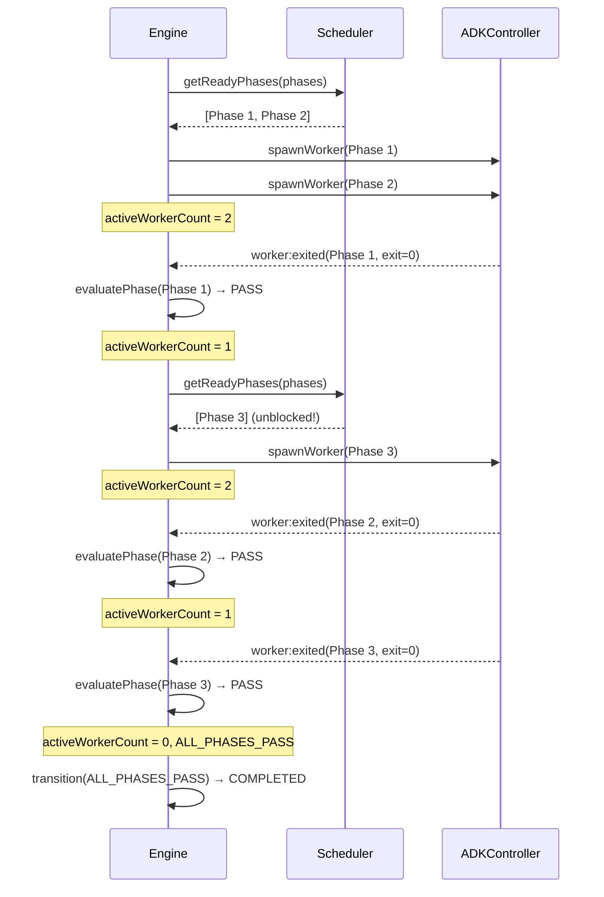
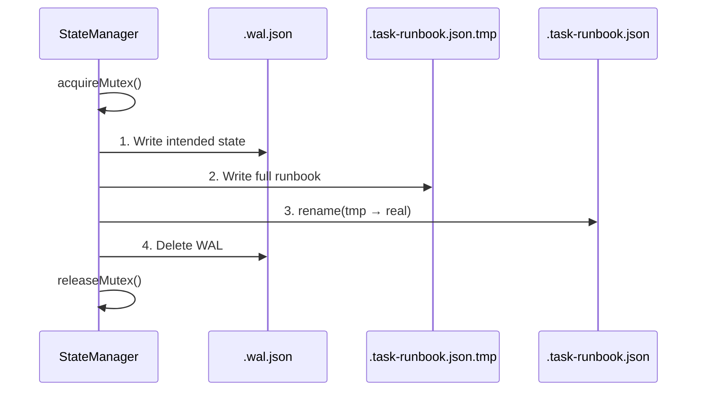
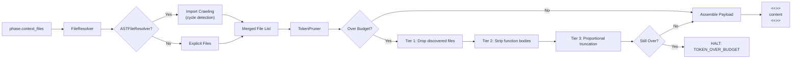
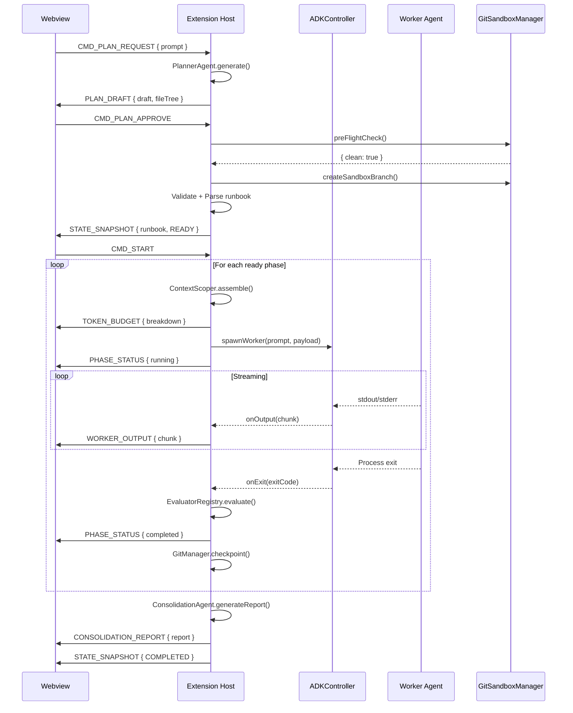
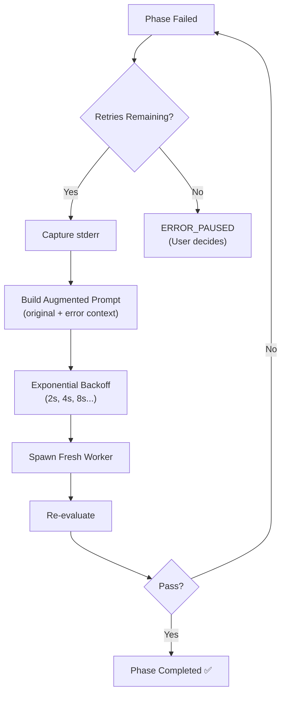

# Coogent — Technical Architecture

> **Audience**: Extension contributors and systems-level developers.

---

## Table of Contents

1. [System Overview](#system-overview)
2. [The 9-State Finite State Machine](#the-9-state-finite-state-machine)
3. [The DAG Execution Engine](#the-dag-execution-engine)
4. [Semantic Distillation (The Pointer Method)](#semantic-distillation-the-pointer-method)
5. [Git Sandboxing](#git-sandboxing)
6. [Persistence Strategy](#persistence-strategy)
7. [Context Scoping Pipeline](#context-scoping-pipeline)
8. [IPC & Message Contract](#ipc--message-contract)
9. [Agent Lifecycle (ADK Integration)](#agent-lifecycle-adk-integration)
10. [Extensibility Hooks](#extensibility-hooks)

---

## System Overview

Coogent implements an **Event-Driven Master-Worker** architecture inside the Antigravity IDE (VS Code fork).



### Component Responsibilities

| Component | Process | Responsibility |
|---|---|---|
| **Extension Host** | Node.js (VS Code Extension API) | Business logic: state machine, runbook I/O, agent lifecycle, logging |
| **Engine** | Extension Host | 9-state FSM: transitions, phase dispatch, parallel orchestration |
| **Scheduler** | Extension Host | DAG-aware phase scheduling with topological ordering and concurrency limits |
| **StateManager** | Extension Host | Crash-safe persistence with WAL + atomic rename + in-process async mutex |
| **ContextScoper** | Extension Host | File reading, AST auto-discovery, token budgeting, payload assembly |
| **ADKController** | Extension Host | Adapter over the Antigravity ADK — spawns/terminates ephemeral workers (parallel pool) |
| **GitSandboxManager** | Extension Host | Native VS Code Git API — sandbox branches, pre-flight checks, diff review |
| **GitManager** | Extension Host | `execFile`-based snapshot commits, rollback, stash/unstash |
| **SelfHealingController** | Extension Host | Auto-retry with exponential backoff and error-injected prompts |
| **EvaluatorRegistry** | Extension Host | Pluggable success evaluation: exit code, regex, toolchain, test suites |
| **PlannerAgent** | Extension Host | AI-powered runbook generation from conversational prompts |
| **ConsolidationAgent** | Extension Host | Post-execution report aggregation from phase handoff files |
| **SessionManager** | Extension Host | Session history discovery, search, pruning |
| **TelemetryLogger** | Extension Host | Append-only JSONL audit trails |
| **Webview Panel** | Sandboxed iframe | Read-only state projection — zero filesystem access |

### Boundary Rules

> **The Webview is a pure projection.** It renders state received from the Extension Host. It never mutates the runbook or spawns agents directly. All user commands are validated server-side before execution.

---

## The 9-State Finite State Machine

The Engine implements a deterministic FSM with **9 states** and **17 events**.



### State Descriptions

| State | Description |
|---|---|
| `IDLE` | No runbook loaded. Waiting for user action. |
| `PLANNING` | Planner Agent is generating a runbook from user prompt. |
| `PLAN_REVIEW` | AI-generated plan awaiting user approval/rejection. |
| `PARSING` | Validating `.task-runbook.json` schema (AJV) and checking file existence. |
| `READY` | Runbook parsed successfully. Awaiting `START` command. |
| `EXECUTING_WORKER` | One or more worker agents are alive and processing phases. |
| `EVALUATING` | Last worker exited. Checking `success_criteria`. |
| `ERROR_PAUSED` | Phase failed or worker crashed. Halted for user decision. |
| `COMPLETED` | All phases passed. Terminal state for the run. |

### Transition Table

The full transition table is defined as a constant lookup in `src/types/index.ts`:

```typescript
const STATE_TRANSITIONS: Record<EngineState, Partial<Record<EngineEvent, EngineState>>> = {
  IDLE:             { PLAN_REQUEST: PLANNING, LOAD_RUNBOOK: PARSING, RESET: IDLE },
  PLANNING:         { PLAN_GENERATED: PLAN_REVIEW, PLAN_REJECTED: PLANNING, ABORT: IDLE, RESET: IDLE },
  PLAN_REVIEW:      { PLAN_APPROVED: PARSING, PLAN_REJECTED: PLANNING, ABORT: IDLE, RESET: IDLE },
  PARSING:          { PARSE_SUCCESS: READY, PARSE_FAILURE: IDLE, ABORT: IDLE, RESET: IDLE },
  READY:            { START: EXECUTING_WORKER, RESUME: EXECUTING_WORKER, ABORT: IDLE, RESET: IDLE },
  EXECUTING_WORKER: { WORKER_EXITED: EVALUATING, WORKER_TIMEOUT: ERROR_PAUSED, WORKER_CRASH: ERROR_PAUSED, ABORT: IDLE, RESET: IDLE },
  EVALUATING:       { PHASE_PASS: EXECUTING_WORKER, ALL_PHASES_PASS: COMPLETED, PHASE_FAIL: ERROR_PAUSED, ABORT: IDLE, RESET: IDLE, RETRY: EXECUTING_WORKER },
  ERROR_PAUSED:     { RETRY: EXECUTING_WORKER, SKIP_PHASE: READY, ABORT: IDLE, RESET: IDLE },
  COMPLETED:        { RESET: IDLE },
};
```

**Strict Enforcement**: All engine methods check the return value of `transition()`. Invalid transitions are silently rejected with an `ERROR` message to the UI.

### The "Abort" Pattern

There is no direct `ABORT` transition from `EXECUTING_WORKER`. Aborting a running worker is a two-step process:

1. Signal termination to the ADK → triggers `WORKER_CRASH` event
2. Engine transitions to `ERROR_PAUSED`
3. User selects `ABORT` from `ERROR_PAUSED` → returns to `IDLE`

---

## The DAG Execution Engine

### Master-Worker Flow

The execution engine follows a 5-step deterministic flow:



### The `.task-runbook.json` Dependency Graph

Each phase can declare `depends_on: number[]` to create a Directed Acyclic Graph:

```json
{
  "phases": [
    { "id": 0, "prompt": "Create data models",         "depends_on": []     },
    { "id": 1, "prompt": "Build API layer",             "depends_on": [0]    },
    { "id": 2, "prompt": "Build CLI tool",              "depends_on": [0]    },
    { "id": 3, "prompt": "Write integration tests",     "depends_on": [1, 2] }
  ]
}
```

This produces the following DAG:



Phases 1 and 2 execute in parallel. Phase 3 waits for both.

### Kahn's Algorithm for Cycle Detection

Before starting execution, the `Scheduler.detectCycles()` method validates the DAG using Kahn's algorithm:

1. Build in-degree map for all phases
2. Seed a queue with zero-in-degree phases
3. Process the queue: decrement in-degree of neighbors
4. If any phases remain with non-zero in-degree → **cycle detected** → raise `CYCLE_DETECTED` error

### The AB-1 Parallel Strategy

To maintain a deterministic FSM while allowing concurrent workers:

1. **Shared State**: The FSM stays in `EXECUTING_WORKER` as long as *any* worker is active (`activeWorkerCount > 0`)
2. **In-Place Evaluation**: When a worker exits, the engine evaluates and updates the phase status directly
3. **Frontier Dispatch**: If a phase completion unblocks new neighbors in the DAG, they are dispatched immediately from within the `EXECUTING_WORKER` state
4. **Terminal Transition**: The transition to `EVALUATING` → `COMPLETED` only occurs when the **last** active worker finishes and no more ready phases exist



---

## Semantic Distillation (The Pointer Method)

### The Problem: Token Bloat in Phase Handoffs

In a multi-phase pipeline, downstream agents need to know what upstream agents accomplished. Naively passing raw code output would re-introduce the context collapse problem.

### The Solution: Pointer Method

Instead of injecting raw code into downstream prompts, Coogent uses **semantic pointers** — concise `context_summary` fields that tell downstream agents *what was done* and *where to look*, without duplicating the code:

```json
{
  "id": 2,
  "prompt": "Build the API layer using the data models.",
  "context_files": ["src/models/index.ts"],
  "context_summary": "Phase 0 created TypeScript interfaces for User and Product in src/models/. Phase 1 added Zod validation schemas. Use these types for request/response typing."
}
```

### How It Works

1. **Phase Execution**: Worker completes Phase N
2. **Handoff Extraction**: The `HandoffExtractor` captures modified files, decisions, and a summary from the worker output
3. **Handoff File**: Results are persisted to `handoffs/phase-{id}.json` in the session directory
4. **Downstream Injection**: When Phase N+1 starts, its prompt is augmented with the `context_summary` — a semantic pointer that references file paths and changes without duplicating content
5. **File Reading**: The downstream worker reads the *actual files* from disk (which were modified by the upstream worker), not from context history

### Why This Works

| Approach | Token Cost | Accuracy |
|---|---|---|
| **Raw Output Passthrough** | 🔴 Exponential growth | 🟡 Contains noise |
| **Full File Re-injection** | 🟡 Linear but expensive | 🟢 Accurate |
| **Pointer Method** | 🟢 Constant per-phase | 🟢 Reads fresh disk state |

The Pointer Method keeps handoff overhead at O(1) per phase while ensuring downstream agents always see the latest file state.

---

## Git Sandboxing

Coogent isolates all AI-generated changes in Git sandbox branches to prevent contaminating the developer's working tree.

### The `coogent/*` Branching Strategy

```mermaid
gitgraph
    commit id: "your-work"
    branch coogent/add-auth-module
    checkout coogent/add-auth-module
    commit id: "Phase 0: models"
    commit id: "Phase 1: service"
    commit id: "Phase 2: routes"
    commit id: "Phase 3: tests"
    checkout main
    merge coogent/add-auth-module id: "merge (manual)"
```

### Architecture: Two Git Managers

| Component | API | Responsibility |
|---|---|---|
| **GitSandboxManager** | Native VS Code Git Extension API (`vscode.extensions.getExtension('vscode.git')`) | Branch operations: pre-flight check, create sandbox branch, open diff review, restore original branch |
| **GitManager** | `child_process.execFile` (no shell injection) | File operations: snapshot commits, rollback (`git reset --hard`), stash/unstash |

> **Critical constraint**: `GitSandboxManager` uses **zero** `child_process` calls. All operations go through the official VS Code Git extension API.

### Pre-Flight Check

Before execution begins:

```typescript
async preFlightCheck(): Promise<PreFlightCheckResult> {
  // 1. Acquire the Git extension API
  // 2. Find the best-matching repository for the workspace root
  // 3. Refresh repository status
  // 4. Check workingTreeChanges and indexChanges
  // 5. Return { clean: boolean, currentBranch: string, message: string }
}
```

If the tree is dirty → execution is blocked with a `GIT_DIRTY` error code.

### Sandbox Branch Lifecycle

1. **Create**: `coogent/<sanitized-task-slug>` branch forked from current HEAD
2. **Checkpoint**: After each successful phase, `GitManager.checkpoint(phaseId)` creates `git add . && git commit -m "coogent: phase <id>"`
3. **Rollback**: On phase failure, `GitManager.rollbackToCommit(hash)` restores to the last clean state
4. **Review**: `GitSandboxManager.openDiffReview()` opens the VS Code SCM panel for native diff review
5. **Restore**: After review, the developer manually merges or discards the sandwich branch

---

## Persistence Strategy

### Runbook File: `.task-runbook.json`

The runbook is the single source of truth for execution state. All mutations flow through `StateManager`.

### Write Safety: WAL + Atomic Rename

To prevent corruption from IDE crashes mid-write:



### Crash Recovery

On extension activation:

1. Check if `.wal.json` exists
2. **If WAL exists**: replay the WAL snapshot → write to `.task-runbook.json` → delete WAL → transition to `ERROR_PAUSED`
3. **If no WAL**: read `.task-runbook.json` normally
4. Check for stale PID files in `.coogent/pid/` and kill orphaned workers

### Concurrency Control

All reads/writes are serialized through an **in-process async mutex** (not POSIX flock). This prevents concurrent writes from parallel phase evaluations corrupting the runbook.

---

## Context Scoping Pipeline

Before spawning a worker, the Context Scoper assembles a token-budgeted payload:



### TokenPruner — 3-Tier Strategy

| Tier | Strategy | Description |
|---|---|---|
| 1 | Drop discovered files | Remove auto-discovered (non-explicit) files, largest first |
| 2 | Strip function bodies | Brace-counting heuristic removes implementations, keeping signatures |
| 3 | Proportional truncation | Truncate remaining large files proportionally to their token share |

---

## IPC & Message Contract

All communication between Webview and Extension Host uses typed `postMessage` payloads with a `type` discriminator.

### Message Flow — Full Execution Cycle



See [API_REFERENCE.md](./API_REFERENCE.md) for the complete IPC message contract with all 15 Host→Webview and 25 Webview→Host message types.

---

## Agent Lifecycle (ADK Integration)

Each phase triggers a 7-step deterministic lifecycle:

```
Init → Scope Context → Token Check → Spawn Worker → Inject Payload → Monitor → Evaluate → Terminate
```

### Worker Isolation

Workers are spawned with:
- **`ephemeral: true`** — No conversation history, no prior file access
- **Scoped injection** — Only the assembled file payload + phase prompt
- **Timeout** — Default 5 minutes, configurable per phase
- **Output streaming** — stdout/stderr piped to Extension Host in real-time via `OutputBuffer` (100ms / 4KB flush)
- **Parallel pool** — Up to `MAX_CONCURRENT_WORKERS` (default 4) simultaneous workers

### Process Registry

The ADK Controller maintains a `Map<phaseId, WorkerHandle>` of active workers and their PIDs. On extension deactivation, all workers are force-terminated via `terminateAll()`. On activation, stale PID files from `.coogent/pid/` are cleaned up.

### Self-Healing Retry Flow



---

## Extensibility Hooks

The architecture supports incremental capability upgrades via pluggable interfaces:

| Extension Point | V1 (Pillar 1) | V2 (Pillars 2 & 3) — ✅ Implemented |
|---|---|---|
| Phase scheduling | Sequential (`current_phase++`) | DAG with `depends_on` via `Scheduler` |
| File resolution | Explicit `context_files` array | AST auto-discovery via `ASTFileResolver` |
| Token management | Hard limit with error halt | 3-tier pruning via `TokenPruner` |
| Success evaluation | Exit code check | Pluggable `EvaluatorRegistry` (exit code, regex, toolchain, test suite) |
| Worker concurrency | Single active worker | Concurrent pool (`Map<phaseId, WorkerHandle>`, max 4) |
| Retry strategy | Manual user action | `SelfHealingController` with exponential backoff |
| Version control | None | `GitManager` + `GitSandboxManager` with sandboxed branches |
| Post-execution | None | `ConsolidationAgent` with aggregated reports |
| Session management | None | `SessionManager` with history, search, and pruning |

---

## Failure Matrix

| # | Failure Scenario | Mitigation |
|---|---|---|
| E1 | Orphaned agent process | `deactivate()` kills all workers. PID file scan on activation. |
| E2 | Runbook file locked | In-process async mutex with timeout. |
| E3 | Token limit breach | `ContextScoper` pre-calculates tokens. `TokenPruner` engages. |
| E4 | Binary file in `context_files` | Rejected with `isBinary()` magic-number check. |
| E5 | File deleted between parse and execution | `ContextScoper.assemble()` re-reads at execution time. |
| E6 | Dirty Git tree | `GitSandboxManager.preFlightCheck()` blocks execution. |
| E7 | Worker hangs | Per-phase timeout with force-termination. |
| E8 | Malformed runbook JSON | AJV schema validation at parse time. |
| E9 | IDE crash mid-write | WAL pattern with atomic rename. |
| E10 | Rapid user commands | FSM rejects invalid transitions silently. |
| E11 | Cyclic dependencies | Kahn's algorithm detects cycles at parse time. |
