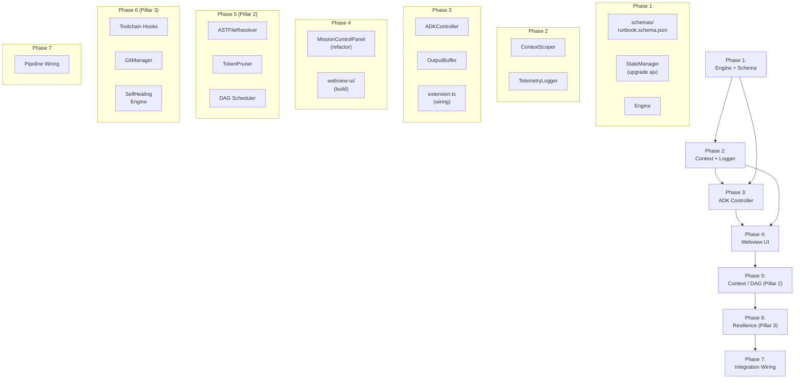

# Implementation Plan — Coogent v2.0 (Pillars 1-3)

**Derived from:** [PRD](./PRD.md) · [ARCHITECTURE](./ARCHITECTURE.md) · [TDD](./TDD.md)  
**Scope:** Pillar 1 (MVP) + Pillar 2 (Intelligent Context) + Pillar 3 (Autonomous Resilience)  
**Status:** Draft — Pending Review  


---

## Current State

### ✅ Completed (Pillar 1 MVP built)

| Module | File | Status |
|---|---|---|
| Type System | `src/types/index.ts` | ✅ Complete — Runbook model, FSM enums, IPC unions, ADK payload |
| Extension Entry | `src/extension.ts` | ✅ Complete — Wired Engine ↔ ADK ↔ Context ↔ Panel + Watcher |
| State Manager | `src/state/StateManager.ts` | ✅ Complete — WAL + atomic rename, lockfile, crash recovery, ajv validation |
| Runbook Schema | `schemas/runbook.schema.json` | ✅ Complete — ajv-compatible JSON Schema |
| Engine | `src/engine/Engine.ts` | ✅ Complete — 7-state FSM with EventEmitter |
| Context Scoper | `src/context/ContextScoper.ts` | ✅ Complete — Read + Token limit budget + Check payload |
| ADK Controller | `src/adk/ADKController.ts` | ✅ Complete — Adapter + worker lifecycle + process cleanup |
| Output Buffer | `src/adk/OutputBuffer.ts` | ✅ Complete — 100ms batched stream flush |
| Telemetry Logger | `src/logger/TelemetryLogger.ts` | ✅ Complete — Append-only JSONL session logging |
| Webview Panel | `src/webview/MissionControlPanel.ts` | ✅ Complete — UI lifecycle and IPC bridge |
| Webview UI | `webview-ui/` | ✅ Complete — esbuild IIFE vanilla JS + CSS |

### 🔲 Remaining (To Build)

| Module | Features | Status |
|---|---|---|
| Context Scoper Extensions | AST Discovery, Token Pruning | 🔲 Pending |
| DAG Scheduler | Dependency graph, Parallel Workers | 🔲 Pending |
| Evaluator Chain | Toolchain Hooks, TDD workflow | 🔲 Pending |
| Auto-Healing | Worker Git isolation, Retry loops | 🔲 Pending |


---

## Phase Plan

### ✅ Phase 1 — Foundation: Engine + Schema Validation

> **Goal:** A working state machine that loads, validates, and transitions through runbook states — testable without any ADK dependency. *(Complete)*

#### 1.1 `schemas/runbook.schema.json`
- Port the JSON Schema from [TDD §6.3](./TDD.md) into a standalone file.
- Validate `project_id`, `status` enum, `current_phase`, and `phases[]` with required fields.

#### 1.2 `src/state/StateManager.ts`
- Replace the manual `validateRunbookSchema()` stub with `ajv` validation against `runbook.schema.json`.
- Add `ajv` as a production dependency.

#### 1.3 `src/engine/Engine.ts`
Core state machine — the brain of the extension.

**Responsibilities:**
- Owns the `EngineState` lifecycle.
- Validates transitions against `STATE_TRANSITIONS` table.
- Emits typed events on state change (EventEmitter pattern).
- Drives the execute loop: `loadRunbook → start → (scope → spawn → monitor → evaluate → advance)* → complete`.
- Calls `StateManager.saveRunbook()` after every state mutation.

**Key methods:**
```
transition(event: EngineEvent): EngineState
loadRunbook(filePath: string): Promise<void>
start(): Promise<void>
pause(): void
abort(): Promise<void>
retry(phaseId: number): Promise<void>
skipPhase(phaseId: number): Promise<void>
```

**Design:**
- Pure state transitions are synchronous (lookup in `STATE_TRANSITIONS`).
- Side effects (ADK calls, file I/O) are async and triggered by transition hooks.
- Invalid transitions are silently rejected with a `LOG_ENTRY` to the Webview.

#### 1.4 Verification
```bash
# Schema validation unit test
npx jest src/state/__tests__/StateManager.test.ts

# State machine transition tests
npx jest src/engine/__tests__/Engine.test.ts
```

---

### ✅ Phase 2 — Context Assembly: Scoper + Logger

> **Goal:** The engine can assemble file context payloads with token counting and log all operations for audit. *(Complete)*

#### 2.1 `src/context/ContextScoper.ts`
File-reading + tokenization pipeline.

**Responsibilities:**
- Resolve `context_files` paths relative to workspace root.
- Guard: file existence check → throw `FILE_NOT_FOUND`.
- Guard: binary detection (magic-number heuristic) → throw `BINARY_FILE`.
- Read file contents as UTF-8.
- Calculate token count (use `js-tiktoken` or character-ratio estimator).
- Check total against `coogent.tokenLimit` config.
- Assemble delimited payload: `<<<FILE: path>>> ... <<<END FILE>>>`.
- Return discriminated `ContextResult` (ok | over-budget).

**Dependency decision — tokenizer:**
- Option A: `js-tiktoken` (npm) — accurate, ~2MB WASM.
- Option B: Character-ratio estimator (`chars / 4`) — fast, no deps, ~10% error.
- **Recommendation:** Ship with Option B for V1, with a pluggable `TokenEncoder` interface for swapping in Option A.

#### 2.2 `src/logger/TelemetryLogger.ts`
Session audit logging.

**Responsibilities:**
- Create `.coogent/logs/<run_id>/` directory tree.
- Append-only JSONL files per phase: `phase-<id>.jsonl`.
- Log entries: timestamp, event type, prompt sent, output received, exit code, duration.
- Serialize full session on worker termination.
- Configurable via `coogent.logDirectory` setting.

#### 2.3 Verification
```bash
# Context Scoper tests (mock file system)
npx jest src/context/__tests__/ContextScoper.test.ts

# Logger tests (mock fs, verify JSONL format)
npx jest src/logger/__tests__/TelemetryLogger.test.ts
```

---

### ✅ Phase 3 — Agent Lifecycle: ADK Controller

> **Goal:** Workers can be spawned, injected with context, monitored, and terminated programmatically. *(Complete)*

#### 3.1 `src/adk/ADKController.ts`
Adapter over the Antigravity ADK API.

**Responsibilities:**
- `spawnWorker(request: WorkerRequest)` → create ephemeral agent session.
- `terminateWorker(handle, reason)` → force-kill and cleanup.
- Orphan prevention: if `activeWorker` exists when spawning, terminate it first.
- Per-phase timeout with `setTimeout` → `onTimeout()` → force-kill.
- Wire `onOutput` and `onExit` event callbacks.
- PID file registry: write to `.coogent/pid/phase-<id>.pid` on spawn, delete on terminate.
- `cleanupOrphanedWorkers()` — called on extension activation, scans stale PIDs.

**ADK API Strategy:**
- Define an `IADKAdapter` interface to decouple from the real ADK.
- Ship a `MockADKAdapter` for testing that simulates spawn/output/exit.
- Swap in the real `AntigravityADKAdapter` at runtime.

#### 3.2 `src/adk/OutputBuffer.ts`
Buffered output streaming to prevent UI thread congestion.

**Specification (from TDD §3.3):**
- 100ms flush interval.
- 4KB max buffer size → immediate flush.
- Combines chunked output into fewer, larger `WORKER_OUTPUT` messages.

#### 3.3 `src/extension.ts`
- Wire `Engine` ↔ `ADKController` ↔ `MissionControlPanel`.
- Route engine events to the Webview via `sendToWebview()`.
- Route Webview commands to engine methods.
- Call `ADKController.cleanupOrphanedWorkers()` in `activate()`.
- Call `ADKController.terminateWorker()` in `deactivate()`.

#### 3.4 Verification
```bash
# ADK Controller tests (with MockADKAdapter)
npx jest src/adk/__tests__/ADKController.test.ts

# Integration test: Engine → ADK → mock worker → evaluate
npx jest src/__tests__/integration.test.ts
```

---

### ✅ Phase 4 — UI: Mission Control Dashboard

> **Goal:** A polished Webview UI that renders runbook state in real-time and handles all user commands. *(Complete)*

#### 4.1 `src/webview/MissionControlPanel.ts`
Refactor the inline Webview code from `extension.ts` into a dedicated module.

**Responsibilities:**
- Panel lifecycle (create, reveal, dispose).
- Load bundled HTML from `webview-ui/`.
- Message routing: receive `WebviewToHostMessage`, forward to engine.
- Send `HostToWebviewMessage` from engine events.
- CSP configuration with nonce.

#### 4.2 `webview-ui/`
Build the Mission Control frontend.

**Components:**
| Component | Responsibility |
|---|---|
| `PhaseList` | Renders all phases with status badges (pending/running/completed/failed) |
| `OutputTerminal` | Live-streaming terminal showing worker stdout/stderr |
| `TokenBudgetBar` | Visual bar showing token usage vs. limit per phase |
| `ControlBar` | Start / Pause / Abort buttons with state-aware enable/disable |
| `PhaseEditor` | Inline editing of phase prompt, files, and success criteria |

**Tech choice:**
- Vanilla JS + CSS (no framework) for V1 — minimal bundle, fast load.
- Receive state via `window.addEventListener('message', ...)`.
- Send commands via `vscode.postMessage(...)`.

#### 4.3 Verification
```bash
# Build webview bundle
node esbuild-webview.js

# Manual: Open Mission Control, load sample runbook, verify rendering
# Manual: Start execution with MockADKAdapter, verify streaming output
```

---

### ✅ Phase 5 — Intelligent Context Management (Pillar 2)

> **Goal:** Transition from static, linear file inclusion to dynamic, AST-driven, parallel DAG execution. *(Implemented)*

#### 5.1 AST Auto-Discovery (`src/context/ASTFileResolver.ts`)
- Integrated `FileResolver` interface.
- Implemented `ASTFileResolver` to crawl import/require/include statements recursively (with cycle detection and depth limiting).

#### 5.2 Token Pruning & Summarization (`src/context/TokenPruner.ts`)
- Implemented 3-tier token pruning: (1) drop discovered files, (2) strip function bodies via brace-counting, (3) proportional truncation.
- Integrated `TokenPruner` returning budget checks.

#### 5.3 DAG Execution & Parallel Processing (`src/engine/Scheduler.ts`)
- Built `Scheduler` to compute a DAG Frontier Set using `depends_on`.
- Implemented Kahn's algorithm for cycle detection and topological sorting.
- Maintained sequential rollback for V1 backward-compatibility.

#### 5.4 Verification
```bash
# Unit test for Pillar 2 modules
npx jest src/__tests__/pillar2_3.test.ts
```

---

### ✅ Phase 6 — Autonomous Resilience & QA (Pillar 3)

> **Goal:** Equip the engine to verify outputs against real toolchains, isolate failures, and self-heal automatically. *(Implemented)*

#### 6.1 Native Toolchain Hooks (`src/evaluators/CompilerEvaluator.ts`)
- Implemented `SuccessEvaluator` chain: Exit Code, Regex Match, Workspace Toolchain commands, and Test Suite output parsing.
- Registered via `EvaluatorRegistry`.

#### 6.2 Automated Version Control (`src/git/GitManager.ts`)
- Created `GitManager` for automated snapshot commits post-phase success.
- Implemented clean-room rollback (`git reset --hard HEAD` and `git clean -fd`) for failed phases.
- Added `stash` functionality to protect in-progress code.

#### 6.3 Self-Healing Loops (`src/engine/SelfHealing.ts`)
- Created `SelfHealingController` to track phase failures, enforce configurable retry limits, and apply exponential backoff.
- Built augmented prompt generator injecting `stderr` context into failed runs.

#### 6.4 Verification
```bash
# Unit test for Pillar 3 modules
npx jest src/__tests__/pillar2_3.test.ts
```

---

### ✅ Phase 7 — Integration Wiring

> **Goal:** Connect Phase 5 & Phase 6 subsystems into `Engine`, `ADKController`, and `extension.ts` pipelines. *(Implemented)*

#### 7.1 Engine Wiring
- Wire `Scheduler`, `EvaluatorRegistry`, and `SelfHealingController` into `Engine`. *(Done)*
- Modify `onWorkerExited` to evaluate dynamically and emit `phase:heal` requests instead of immediately halting. *(Done)*

#### 7.2 Context + ADK Wiring
- Wire `FileResolver` and `TokenPruner` into `ContextScoper.assemble()`. *(Done)*
- Update `ADKController` to maintain a pool of active workers (`Map<number, WorkerHandle>`) subject to `MAX_CONCURRENT_WORKERS`. *(Done)*
- Hook `GitManager` in `extension.ts` on `phase:checkpoint` events. *(Done)*

#### 7.3 Tests & Stabilization
- Write comprehensive e2e integration tests mocking DAG paths, multi-worker overlaps, and self-healing cycles.

#### 7.4 Verification
```bash
# Run the full test suite
npx jest
```

---

## Dependency Graph



---

## New Dependencies

| Package | Purpose | Phase |
|---|---|---|
| `ajv` | JSON Schema validation for runbook files | 1 |
| `js-tiktoken` *(optional)* | Accurate token counting (WASM) | 2 |
| `jest` + `ts-jest` | Unit testing framework | 1 |
| `@types/jest` | Jest type definitions | 1 |
| `tree-sitter` | AST discovery and partial parsing | 5 |
| `simple-git` | Worker Git sandboxing | 6 |

---

## Risk Register

| Risk | Impact | Mitigation |
|---|---|---|
| ADK API not yet available / undocumented | Phase 3 blocked | Abstract behind `IADKAdapter` interface; develop against `MockADKAdapter` |
| `js-tiktoken` WASM too large for extension bundle | Slow extension activation | Ship with char-ratio estimator; make tokenizer pluggable |
| Webview CSP blocks dynamic content | UI rendering broken | Use nonce-based CSP; test with strict policies from Phase 4 start |
| Runbook schema changes break persistence | Corrupt state files | Version the schema (`"schema_version": 1`); write migration logic in StateManager |
| Multiple Parallel workers cause race conditions | Broken Git index or overlapping writes | Isolate file execution boundaries or ensure sequential sub-locks via ADK. |
| Self-healing loops repeatedly fail | Hallucination infinite loop | Enforce `MAX_RETRIES` and increment timeout thresholds on consecutive errors. |

---

## File Manifest — Pillars 1-3 Structure

```
Coogent/
├── docs/
│   ├── PRD.md
│   ├── ARCHITECTURE.md
│   ├── TDD.md
│   └── IMPLEMENTATION_PLAN.md      ← Updated for Phases 5, 6, 7
├── schemas/
│   └── runbook.schema.json          ← Updated for Pillars 2 & 3
├── src/
│   ├── extension.ts                 ← Modifying in Phase 7
│   ├── types/
│   │   └── index.ts                 ✅ done
│   ├── state/
│   │   └── StateManager.ts          ✅ done
│   ├── engine/
│   │   ├── Engine.ts    ← Wired in Phase 7
│   │   ├── Scheduler.ts             ✅ done (Phase 5)
│   │   └── SelfHealing.ts           ✅ done (Phase 6)
│   ├── context/
│   │   ├── ContextScoper.ts         ← Modifying in Phase 7
│   │   ├── FileResolver.ts          ✅ done (Phase 5)
│   │   └── TokenPruner.ts           ✅ done (Phase 5)
│   ├── logger/
│   │   └── TelemetryLogger.ts       ✅ done
│   ├── adk/
│   │   ├── ADKController.ts         ← Modifying in Phase 7
│   │   └── OutputBuffer.ts          ✅ done
│   ├── webview/
│   │   └── MissionControlPanel.ts   ✅ done
│   ├── git/
│   │   └── GitManager.ts            ✅ done (Phase 6)
│   └── evaluators/
│       └── CompilerEvaluator.ts     ✅ done (Phase 6)
│   └── __tests__/
│       ├── integration.test.ts
│       └── pillar2_3.test.ts        ✅ done
├── webview-ui/                      ✅ done
│   ├── index.html
│   ├── app.js
│   └── styles.css
├── README.md
├── package.json
├── tsconfig.json
├── esbuild.js
└── .gitignore
```
