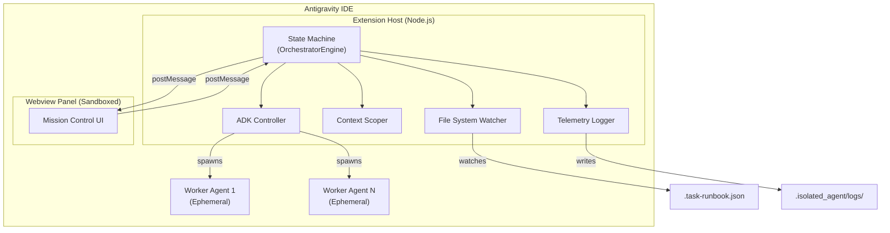
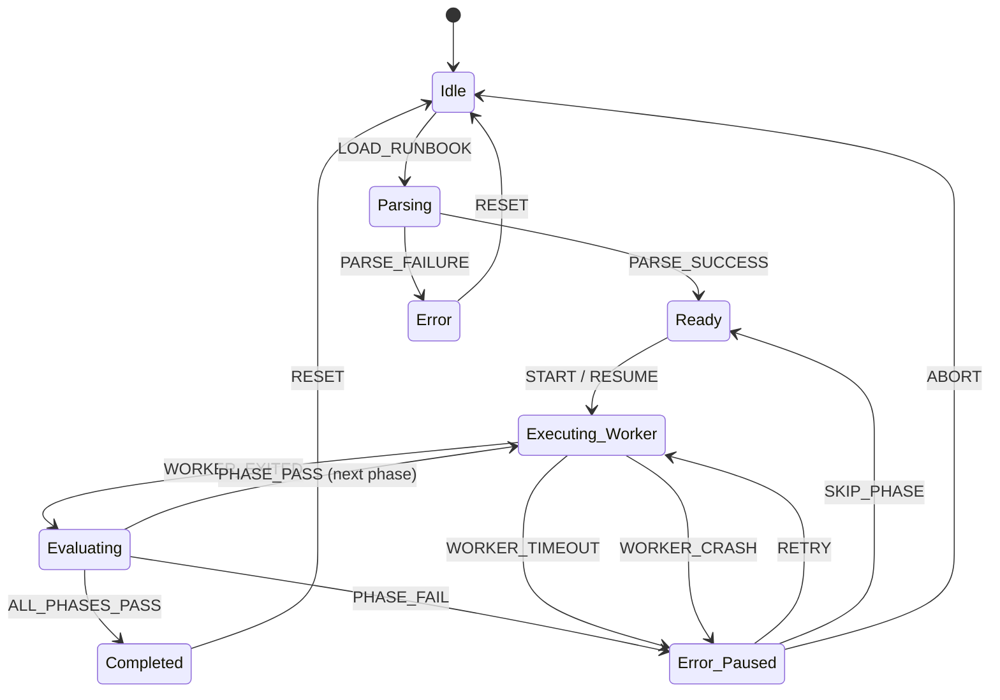
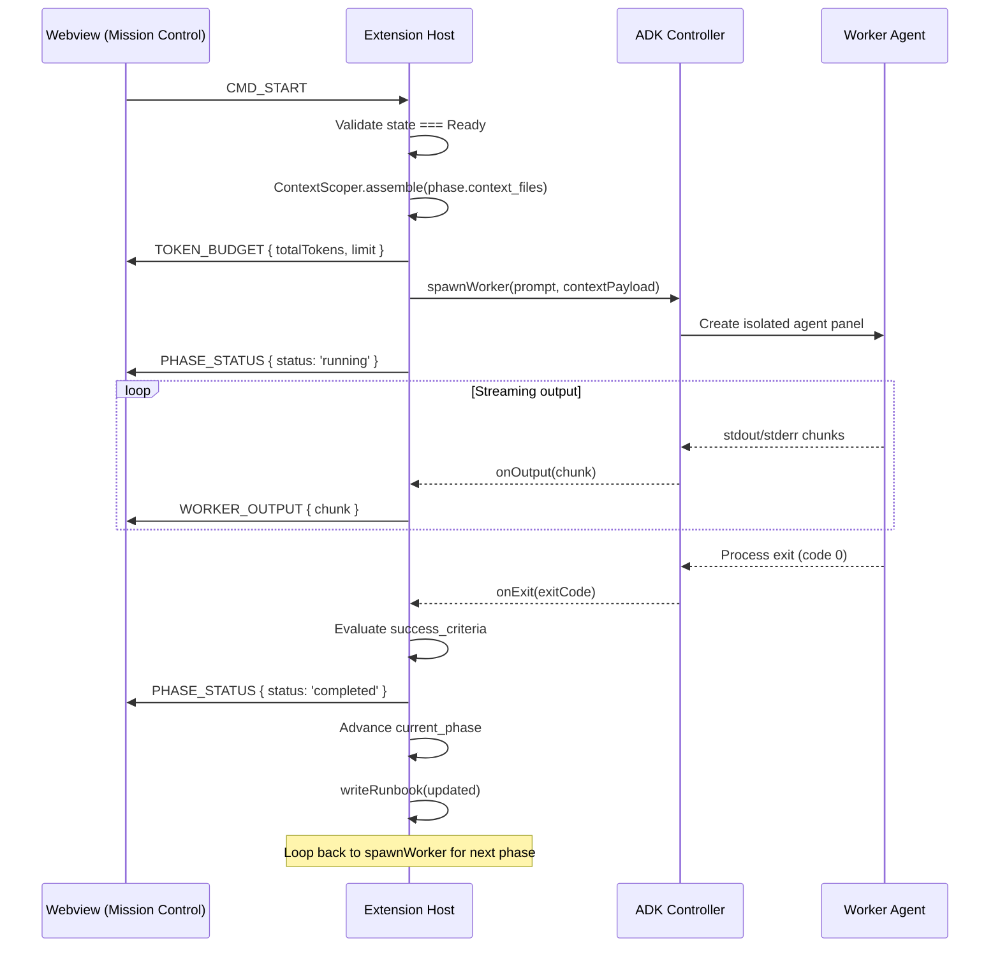
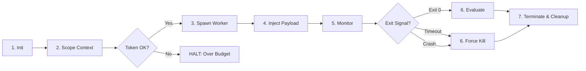

# Technical Design Document: "Clean Room" Multi-Agent Orchestrator

**Platform:** Google Antigravity IDE (VS Code Fork)  
**Version:** 2.0 — Pillars 1-3 (Full Orchestration Pipeline)  
**Authors:** Architecture Team  
**Status:** Draft  

---

## Table of Contents

1. [High-Level System Architecture](#1-high-level-system-architecture)  
2. [State Machine & Persistence Strategy](#2-state-machine--persistence-strategy)  
3. [IPC & Component Communication Contract](#3-ipc--component-communication-contract)  
4. [Agent Lifecycle & ADK Integration](#4-agent-lifecycle--adk-integration)  
5. [Extensibility for Future Pillars](#5-extensibility-for-future-pillars)  
6. [Edge Cases & Mitigations](#6-edge-cases--mitigations)  
7. [Pillar 2: Intelligent Context Management Architecture](#7-pillar-2-intelligent-context-management-architecture)  
8. [Pillar 3: Autonomous Resilience & QA Architecture](#8-pillar-3-autonomous-resilience--qa-architecture)  

---

## 1. High-Level System Architecture

### 1.1 Component Overview

The extension is composed of four decoupled subsystems running inside the Antigravity IDE process tree:



### 1.2 Component Responsibilities

| Component | Process | Responsibility |
|---|---|---|
| **Extension Host** | Node.js (VS Code Extension API) | Houses all business logic: state machine, ADK calls, file I/O, logging. The **single source of truth** for execution state. |
| **OrchestratorEngine** | Extension Host | The deterministic state machine. Reads the runbook, decides transitions, dispatches commands to the ADK Controller. |
| **ADK Controller** | Extension Host | Thin adapter over the Antigravity ADK API. Translates `spawnWorker` / `terminateWorker` intents into platform calls. Manages the process handle registry. |
| **Context Scoper** | Extension Host | Reads `context_files`, concatenates content, calculates token count (via `tiktoken` or equivalent), and assembles the injection payload. |
| **File System Watcher** | Extension Host | Monitors `.task-runbook.json` for external edits (e.g., manual developer changes) and triggers re-parsing. |
| **Telemetry Logger** | Extension Host | Serializes all prompts, agent outputs, and state transitions to `.isolated_agent/logs/<run_id>/` as append-only JSONL files. |
| **Webview Panel** | Isolated iframe (chromium renderer) | Renders the Mission Control dashboard. Communicates **exclusively** via `postMessage`. Has zero direct access to Node.js APIs, filesystem, or ADK. |

### 1.3 Boundary Rules

> [!IMPORTANT]
> **The Webview is a pure projection.** It renders state received from the Extension Host. It never mutates the runbook directly. All user commands are sent as typed messages and validated server-side before execution.

- **Extension Host → Webview:** Read-only state snapshots and streaming output events.
- **Webview → Extension Host:** User intent commands (start, pause, abort, edit).
- **Extension Host → ADK:** Spawn/terminate/inject lifecycle calls.
- **Extension Host → File System:** All runbook reads/writes are serialized through a single `RunbookStore` class with file locking.

---

## 2. State Machine & Persistence Strategy

### 2.1 State Machine Definition

The OrchestratorEngine implements a deterministic finite state machine with 7 states:



| State | Description |
|---|---|
| `Idle` | No runbook loaded. Waiting for user action. |
| `Parsing` | Validating `.task-runbook.json` schema and file existence. |
| `Ready` | Runbook parsed successfully. Awaiting `START` command. |
| `Executing_Worker` | An ADK worker agent is alive and processing the current phase. |
| `Evaluating` | Worker exited. Checking `success_criteria` against exit code/output. |
| `Error_Paused` | A phase failed or a worker crashed. Execution halted pending user decision. |
| `Completed` | All phases passed. Terminal state for the run. |

### 2.2 Transition Table

```typescript
type OrchestratorState =
  | 'Idle'
  | 'Parsing'
  | 'Ready'
  | 'Executing_Worker'
  | 'Evaluating'
  | 'Error_Paused'
  | 'Completed';

type OrchestratorEvent =
  | 'LOAD_RUNBOOK'
  | 'PARSE_SUCCESS'
  | 'PARSE_FAILURE'
  | 'START'
  | 'RESUME'
  | 'WORKER_EXITED'
  | 'PHASE_PASS'
  | 'PHASE_FAIL'
  | 'ALL_PHASES_PASS'
  | 'WORKER_TIMEOUT'
  | 'WORKER_CRASH'
  | 'RETRY'
  | 'SKIP_PHASE'
  | 'ABORT'
  | 'RESET';

const transitions: Record<OrchestratorState, Partial<Record<OrchestratorEvent, OrchestratorState>>> = {
  Idle:             { LOAD_RUNBOOK: 'Parsing' },
  Parsing:          { PARSE_SUCCESS: 'Ready', PARSE_FAILURE: 'Idle' },
  Ready:            { START: 'Executing_Worker', RESUME: 'Executing_Worker' },
  Executing_Worker: { WORKER_EXITED: 'Evaluating', WORKER_TIMEOUT: 'Error_Paused', WORKER_CRASH: 'Error_Paused' },
  Evaluating:       { PHASE_PASS: 'Executing_Worker', ALL_PHASES_PASS: 'Completed', PHASE_FAIL: 'Error_Paused' },
  Error_Paused:     { RETRY: 'Executing_Worker', SKIP_PHASE: 'Ready', ABORT: 'Idle' },
  Completed:        { RESET: 'Idle' },
};
```

### 2.3 Persistence & File Locking

All runbook mutations flow through the `RunbookStore` singleton:

```typescript
class RunbookStore {
  private lockHandle: fs.FileHandle | null = null;

  /** Acquire an exclusive POSIX lock before any write. */
  async acquireLock(): Promise<void> {
    this.lockHandle = await fs.open(RUNBOOK_LOCK_PATH, 'w');
    await flock(this.lockHandle.fd, LOCK_EX); // node:fs or flock binding
  }

  async releaseLock(): Promise<void> {
    if (this.lockHandle) {
      await flock(this.lockHandle.fd, LOCK_UN);
      await this.lockHandle.close();
      this.lockHandle = null;
    }
  }

  async writeRunbook(runbook: Runbook): Promise<void> {
    await this.acquireLock();
    try {
      // 1. Write WAL entry first (crash recovery)
      await fs.writeFile(WAL_PATH, JSON.stringify({
        timestamp: Date.now(),
        state: runbook.status,
        current_phase: runbook.current_phase,
        snapshot: runbook,
      }));
      // 2. Atomic write: write to temp, then rename
      const tmp = RUNBOOK_PATH + '.tmp';
      await fs.writeFile(tmp, JSON.stringify(runbook, null, 2));
      await fs.rename(tmp, RUNBOOK_PATH);
      // 3. Clear WAL
      await fs.unlink(WAL_PATH).catch(() => {});
    } finally {
      await this.releaseLock();
    }
  }
}
```

### 2.4 Crash Recovery

On extension activation, the recovery sequence is:

```
1. Check if WAL file exists at `.isolated_agent/ipc/<id>/.wal.json`
2. IF WAL exists:
   a. Read WAL snapshot → this is the last intended state
   b. Write WAL snapshot to `.task-runbook.json` (completing the interrupted write)
   c. Delete WAL
   d. Transition state machine to `Error_Paused` (let user decide to resume)
3. IF no WAL:
   a. Read `.task-runbook.json` normally
   b. If `status === 'running'`, transition to `Error_Paused` (unclean shutdown)
   c. If `status === 'idle' | 'completed'`, transition to `Idle` or `Completed`
```

> [!NOTE]
> The WAL (Write-Ahead Log) pattern ensures that even if the IDE crashes between writing the temp file and renaming it, the intended state is never lost.

---

## 3. IPC & Component Communication Contract

### 3.1 Message Protocol

All messages between Webview and Extension Host use a discriminated union typed by `type`:

```typescript
// ═══════════════════════════════════════════════
//  Extension Host → Webview  (State Projections)
// ═══════════════════════════════════════════════

type HostToWebview =
  | { type: 'STATE_SNAPSHOT';     payload: RunbookSnapshot }
  | { type: 'PHASE_STATUS';      payload: { phaseId: number; status: PhaseStatus; durationMs?: number } }
  | { type: 'WORKER_OUTPUT';     payload: { phaseId: number; stream: 'stdout' | 'stderr'; chunk: string } }
  | { type: 'TOKEN_BUDGET';      payload: { phaseId: number; fileTokens: FileTokenMap; totalTokens: number; limit: number } }
  | { type: 'ERROR';             payload: { code: string; message: string; phaseId?: number } }
  | { type: 'LOG_ENTRY';         payload: { timestamp: number; level: 'info' | 'warn' | 'error'; message: string } };

// ═══════════════════════════════════════════════
//  Webview → Extension Host  (User Commands)
// ═══════════════════════════════════════════════

type WebviewToHost =
  | { type: 'CMD_START' }
  | { type: 'CMD_PAUSE' }
  | { type: 'CMD_ABORT' }
  | { type: 'CMD_RETRY';         payload: { phaseId: number } }
  | { type: 'CMD_SKIP_PHASE';    payload: { phaseId: number } }
  | { type: 'CMD_EDIT_PHASE';    payload: { phaseId: number; patch: Partial<Phase> } }
  | { type: 'CMD_LOAD_RUNBOOK';  payload: { filePath: string } }
  | { type: 'CMD_REQUEST_STATE' };

type FileTokenMap = Record<string, number>; // filepath → token count
```

### 3.2 Message Flow — Execution Cycle



### 3.3 Output Streaming Strategy

Worker output is streamed to the Webview in real-time using a **buffered flush** pattern to avoid UI thread congestion:

```typescript
class OutputBuffer {
  private buffer = '';
  private flushTimer: NodeJS.Timeout | null = null;
  private readonly FLUSH_INTERVAL_MS = 100;
  private readonly MAX_BUFFER_SIZE = 4096;

  append(chunk: string): void {
    this.buffer += chunk;
    if (this.buffer.length >= this.MAX_BUFFER_SIZE) {
      this.flush();
    } else if (!this.flushTimer) {
      this.flushTimer = setTimeout(() => this.flush(), this.FLUSH_INTERVAL_MS);
    }
  }

  private flush(): void {
    if (this.buffer.length > 0) {
      this.postToWebview({ type: 'WORKER_OUTPUT', payload: { phaseId: this.phaseId, stream: 'stdout', chunk: this.buffer } });
      this.buffer = '';
    }
    if (this.flushTimer) {
      clearTimeout(this.flushTimer);
      this.flushTimer = null;
    }
  }
}
```

---

## 4. Agent Lifecycle & ADK Integration

### 4.1 Worker Agent Lifecycle

Each phase triggers the following deterministic lifecycle:



### 4.2 Lifecycle Phases in Detail

#### Phase 1: Initialization
```typescript
interface WorkerRequest {
  phaseId: number;
  prompt: string;
  contextPayload: string;   // concatenated file contents
  timeoutMs: number;         // default: 300_000 (5 min)
  workingDirectory: string;
}
```

#### Phase 2: Context Scoping (the "Context Scoper")

The Context Scoper assembles the injection payload:

```typescript
class ContextScoper {
  private readonly encoder: TiktokenEncoder; // e.g., cl100k_base
  private readonly TOKEN_LIMIT: number;      // configurable, default 100_000

  async assemble(files: string[], workspaceRoot: string): Promise<ContextResult> {
    const entries: FileEntry[] = [];
    let totalTokens = 0;

    for (const relativePath of files) {
      const absPath = path.resolve(workspaceRoot, relativePath);

      // Guard: file exists?
      if (!await fileExists(absPath)) {
        throw new ContextError(`File not found: ${relativePath}`, 'FILE_NOT_FOUND');
      }

      // Guard: file is text, not binary
      if (await isBinary(absPath)) {
        throw new ContextError(`Binary file rejected: ${relativePath}`, 'BINARY_FILE');
      }

      const content = await fs.readFile(absPath, 'utf-8');
      const tokenCount = this.encoder.encode(content).length;

      entries.push({ path: relativePath, content, tokenCount });
      totalTokens += tokenCount;
    }

    // Guard: total tokens within budget
    if (totalTokens > this.TOKEN_LIMIT) {
      return {
        ok: false,
        totalTokens,
        limit: this.TOKEN_LIMIT,
        breakdown: entries.map(e => ({ path: e.path, tokens: e.tokenCount })),
      };
    }

    // Assemble payload with clear delimiters
    const payload = entries.map(e =>
      `<<<FILE: ${e.path}>>>\n${e.content}\n<<<END FILE>>>`
    ).join('\n\n');

    return { ok: true, payload, totalTokens, limit: this.TOKEN_LIMIT, breakdown: entries.map(e => ({ path: e.path, tokens: e.tokenCount })) };
  }
}
```

#### Phase 3: Spawn Worker

```typescript
class ADKController {
  private activeWorker: WorkerHandle | null = null;

  async spawnWorker(request: WorkerRequest): Promise<WorkerHandle> {
    // Ensure no orphans
    if (this.activeWorker) {
      await this.terminateWorker(this.activeWorker, 'ORPHAN_PREVENTION');
    }

    const handle = await antigravityADK.createAgentSession({
      zeroContext: true,             // No history, no prior files
      workingDirectory: request.workingDirectory,
      initialPrompt: this.buildInjectionPrompt(request),
    });

    this.activeWorker = {
      handle,
      phaseId: request.phaseId,
      startedAt: Date.now(),
      timeoutTimer: setTimeout(
        () => this.onTimeout(handle),
        request.timeoutMs
      ),
    };

    // Wire output streams
    handle.onStdout((chunk) => this.emit('output', { phaseId: request.phaseId, stream: 'stdout', chunk }));
    handle.onStderr((chunk) => this.emit('output', { phaseId: request.phaseId, stream: 'stderr', chunk }));
    handle.onExit((code) => this.onExit(request.phaseId, code));

    return this.activeWorker;
  }

  private buildInjectionPrompt(req: WorkerRequest): string {
    return [
      `## Task`,
      req.prompt,
      ``,
      `## Context Files`,
      `The following files are provided for reference. Work ONLY with these files.`,
      ``,
      req.contextPayload,
    ].join('\n');
  }
}
```

#### Phases 4–7: Monitor → Evaluate → Terminate

```typescript
// On worker exit:
private async onExit(phaseId: number, exitCode: number): Promise<void> {
  clearTimeout(this.activeWorker?.timeoutTimer);

  // Log full session
  await this.logger.serializeSession(phaseId, this.activeWorker);

  const phase = this.runbook.phases.find(p => p.id === phaseId)!;
  const passed = this.evaluateSuccess(phase.success_criteria, exitCode);

  // Terminate the session window
  await this.terminateWorker(this.activeWorker!, passed ? 'COMPLETED' : 'FAILED');
  this.activeWorker = null;

  this.emit(passed ? 'PHASE_PASS' : 'PHASE_FAIL', { phaseId, exitCode });
}

private evaluateSuccess(criteria: string, exitCode: number): boolean {
  // V1: Simple exit code check
  if (criteria.startsWith('exit_code:')) {
    const expected = parseInt(criteria.split(':')[1], 10);
    return exitCode === expected;
  }
  // Default: exit 0
  return exitCode === 0;
}
```

### 4.3 Process Handle Registry

To prevent orphaned processes, the ADK Controller maintains a registry:

```typescript
interface WorkerHandle {
  handle: ADKSessionHandle;
  phaseId: number;
  startedAt: number;
  timeoutTimer: NodeJS.Timeout;
}

// On extension deactivation:
async deactivate(): Promise<void> {
  if (this.activeWorker) {
    await this.terminateWorker(this.activeWorker, 'IDE_SHUTDOWN');
  }
}
```

---

## 5. Extensibility for Future Pillars

### 5.1 DAG Execution (Pillar 2)

The V1 architecture uses sequential phase IDs. To support DAGs:

```typescript
// V1: Sequential
interface PhaseV1 {
  id: number;
  // ...
}

// V2: DAG-ready — add 'depends_on' field
interface PhaseV2 extends PhaseV1 {
  depends_on?: number[];  // IDs of phases that must complete first
}
```

The state machine generalizes from `current_phase: number` to a **frontier set**:

```typescript
// V2 scheduler
function getReadyPhases(phases: PhaseV2[]): PhaseV2[] {
  return phases.filter(p =>
    p.status === 'pending' &&
    (p.depends_on ?? []).every(depId =>
      phases.find(d => d.id === depId)?.status === 'completed'
    )
  );
}
```

The `ADKController` generalizes from a single `activeWorker` to a `Map<number, WorkerHandle>`:

```typescript
// V1
private activeWorker: WorkerHandle | null = null;

// V2
private activeWorkers: Map<number, WorkerHandle> = new Map();
private readonly MAX_CONCURRENT_WORKERS = 4;
```

### 5.2 AST Auto-Discovery (Pillar 2)

The `ContextScoper` has a pluggable `FileResolver` interface:

```typescript
// V1: Files are listed explicitly in the runbook
interface FileResolver {
  resolve(phase: Phase, workspaceRoot: string): Promise<string[]>;
}

class ExplicitFileResolver implements FileResolver {
  async resolve(phase: Phase): Promise<string[]> {
    return phase.context_files;
  }
}

// V2: Tree-sitter walks the AST to discover imports/dependencies
class ASTFileResolver implements FileResolver {
  async resolve(phase: Phase, workspaceRoot: string): Promise<string[]> {
    const explicit = phase.context_files;
    const discovered = await treeSitterWalk(explicit, workspaceRoot);
    return [...new Set([...explicit, ...discovered])];
  }
}
```

### 5.3 Success Criteria Extensibility (Pillar 3)

```typescript
// V1: Exit code only
// V2: Pluggable evaluators
interface SuccessEvaluator {
  evaluate(criteria: string, exitCode: number, stdout: string, stderr: string): Promise<boolean>;
}

class ExitCodeEvaluator implements SuccessEvaluator { /* ... */ }
class RegexOutputEvaluator implements SuccessEvaluator { /* ... */ }
class CompilerEvaluator implements SuccessEvaluator { /* ... */ }  // xcodebuild, make
class TestSuiteEvaluator implements SuccessEvaluator { /* ... */ }  // pytest, jest
```

### 5.4 Extension Points Summary

| Extension Point | V1 Implementation | V2+ Target |
|---|---|---|
| Phase scheduling | Linear `current_phase++` | DAG frontier scheduler |
| File resolution | Explicit `context_files` array | AST-based auto-discovery |
| Success evaluation | Exit code check | Pluggable evaluator chain |
| Worker concurrency | Single `activeWorker` | Pool with `MAX_CONCURRENT` |
| Retry strategy | Manual (user presses Resume) | Auto-retry with exponential backoff |

---

## 6. Edge Cases & Mitigations

### 6.1 Failure Matrix

| # | Failure Scenario | Impact | Mitigation |
|---|---|---|---|
| E1 | **Orphaned agent process** — IDE crashes while worker is running | Zombie OS process consuming resources | `deactivate()` hook kills active workers. On activation, scan for stale PID files in `.isolated_agent/pid/` and send `SIGTERM`. |
| E2 | **Runbook file locked** — External editor holds an `flock` | `writeRunbook` hangs indefinitely | Acquire lock with a **5-second timeout**. If timeout, transition to `Error_Paused` with message "Runbook locked by another process." |
| E3 | **Token limit breach** — `context_files` exceed model window | Worker hallucinates or truncates output | `ContextScoper` pre-calculates tokens. If over budget, halt with `TOKEN_BUDGET` message to UI. User must split the phase. |
| E4 | **Binary file in `context_files`** | Corrupt injection payload | `ContextScoper` rejects binary files with `isBinary()` check (magic-number heuristic). |
| E5 | **File deleted between parse and execution** — race condition | Worker receives incomplete context | `ContextScoper.assemble()` re-reads all files at execution time, not at parse time. If file is missing, halt to `Error_Paused`. |
| E6 | **Git tree conflict** — Another tool modifies files during worker execution | Worker output clobbers concurrent changes | V1: Log a warning. V2: Implement file-level advisory locks and stash/unstash before phase execution. |
| E7 | **Worker hangs** — Agent enters infinite loop or waits for input | Phase never completes | Per-phase timeout (default 5 min, configurable). `ADKController.onTimeout()` force-terminates the worker. |
| E8 | **Malformed runbook JSON** — Invalid schema, missing fields | Crash or undefined behavior | Schema validation via `ajv` (JSON Schema) at parse time. Invalid runbooks → `Error` state with diagnostic message. |
| E9 | **IDE crash mid-write** — `writeRunbook` interrupted | Corrupted or half-written runbook | WAL pattern (§2.4): write intent to journal first, then atomic `rename()`. Recovery reads WAL on restart. |
| E10 | **Rapid user commands** — User spams Start/Abort/Retry | State machine receives conflicting events | All commands validated against current state. Invalid transitions are silently rejected with an `ERROR` message to the UI. |

### 6.2 PID File Strategy for Orphan Recovery

```typescript
const PID_DIR = '.isolated_agent/pid';

async function registerWorkerPID(phaseId: number, pid: number): Promise<void> {
  await fs.writeFile(path.join(PID_DIR, `phase-${phaseId}.pid`), String(pid));
}

async function cleanupOrphanedWorkers(): Promise<void> {
  const pidFiles = await fs.readdir(PID_DIR).catch(() => []);
  for (const file of pidFiles) {
    const pid = parseInt(await fs.readFile(path.join(PID_DIR, file), 'utf-8'), 10);
    try {
      process.kill(pid, 0);          // Check if process exists
      process.kill(pid, 'SIGTERM');   // Kill orphan
      log.warn(`Killed orphaned worker PID ${pid}`);
    } catch {
      // Process already dead — clean up PID file
    }
    await fs.unlink(path.join(PID_DIR, file)).catch(() => {});
  }
}
```

### 6.3 Runbook Schema (JSON Schema for Validation)

```json
{
  "$schema": "http://json-schema.org/draft-07/schema#",
  "type": "object",
  "required": ["project_id", "status", "current_phase", "phases"],
  "properties": {
    "project_id": { "type": "string", "minLength": 1 },
    "status": {
      "type": "string",
      "enum": ["idle", "running", "paused_error", "completed"]
    },
    "current_phase": { "type": "integer", "minimum": 0 },
    "phases": {
      "type": "array",
      "minItems": 1,
      "items": {
        "type": "object",
        "required": ["id", "status", "prompt", "context_files", "success_criteria"],
        "properties": {
          "id": { "type": "integer" },
          "status": { "type": "string", "enum": ["pending", "running", "completed", "failed"] },
          "prompt": { "type": "string", "minLength": 1 },
          "context_files": { "type": "array", "items": { "type": "string" } },
          "success_criteria": { "type": "string", "minLength": 1 }
        }
      }
    }
  }
}
```

---

## Appendix A: Directory Layout

```
.vscode/extensions/clean-room-orchestrator/
├── src/
│   ├── extension.ts              # activate/deactivate entry point
│   ├── engine/
│   │   ├── OrchestratorEngine.ts # State machine
│   │   ├── transitions.ts       # Transition table
│   │   └── types.ts             # State/Event types
│   ├── adk/
│   │   ├── ADKController.ts     # Agent spawn/terminate
│   │   └── OutputBuffer.ts      # Streaming buffer
│   ├── context/
│   │   ├── ContextScoper.ts     # File reading + token counting
│   │   └── FileResolver.ts      # Pluggable file resolution interface
│   ├── store/
│   │   ├── RunbookStore.ts      # Read/write/lock runbook
│   │   └── WAL.ts               # Write-ahead log
│   ├── logger/
│   │   └── TelemetryLogger.ts   # JSONL session logging
│   └── webview/
│       ├── MissionControlPanel.ts# Webview lifecycle
│       └── messages.ts          # IPC type definitions
├── webview-ui/                   # Bundled separately (Vite/esbuild)
│   ├── index.html
│   ├── App.tsx
│   └── components/
│       ├── PhaseList.tsx
│       ├── OutputTerminal.tsx
│       └── TokenBudgetBar.tsx
├── schemas/
│   └── runbook.schema.json
└── package.json
```

## Appendix B: Configuration Defaults

```jsonc
// package.json contributes.configuration
{
  "cleanRoom.tokenLimit": 100000,
  "cleanRoom.workerTimeoutMs": 300000,
  "cleanRoom.maxRetries": 3,
  "cleanRoom.logDirectory": ".isolated_agent/logs",
  "cleanRoom.pidDirectory": ".isolated_agent/pid"
}
```

---

## 7. Pillar 2: Intelligent Context Management Architecture

Pillar 2 replaces the static, manual `context_files` array with dynamic, AST-driven discovery and automatic token optimization, allowing tasks to execute concurrently if they have no dependencies.

### 7.1 AST Auto-Discovery (`ASTFileResolver`)
- **Mechanism:** Leverages `tree-sitter` to parse the explicit entrypoint files provided in a phase's `context_files`.
- **Dependency Crawling:** Walks the Abstract Syntax Tree to identify `import`, `require`, or `#include` statements.
- **Resolution:** Maps these statements to absolute file paths within the workspace.
- **Deduplication:** Merges explicitly defined files with discovered dependencies, removing duplicates.

### 7.2 Token Pruning & Summarization (`TokenPruner`)
- **Threshold Check:** After resolution, if total tokens > `TOKEN_LIMIT`, the `TokenPruner` engages.
- **Heuristic Pruning:** Uses `tree-sitter` to strip function/method bodies from imported dependencies (keeping only signatures/interfaces) to drastically reduce token payload while preserving structural context.
- **Agentic Summarization:** For files that cannot be pruned heuristically (e.g., dense untyped scripts), spawns a lightweight background agent to generate a dense summary of the file.

### 7.3 DAG Execution & Parallel Processing
- **Schema Update:** The Runbook schema is updated so each phase has an optional `depends_on: number[]` array.
- **Frontier Set Scheduler:** The `OrchestratorEngine` state machine evaluates the graph to find all "ready" phases (phases where `depends_on` dependencies are all `completed`).
- **Parallel Dispatch:** `ADKController` spins up a worker for each "ready" phase concurrently, up to a configurable `MAX_CONCURRENT_WORKERS`.
- **State Synchronization:** Worker completions trigger a state machine event that re-evaluates the Frontier Set, spawning the next batch of ready workers.


## 8. Pillar 3: Autonomous Resilience & QA Architecture

Pillar 3 shifts the definition of "done" from a simple worker exit to verifiable correctness using real compilers, tests, and auto-healing retry loops.

### 8.1 Native Toolchain Hooks (`CompilerEvaluator`)
- **Evaluator Chain:** Replaces the static exit code check with a pluggable `SuccessEvaluator` chain.
- **Workspace Integration:** When a worker finishes, the Engine runs the phase's `success_criteria` (e.g., `make test` or `xcodebuild`) directly in the workspace.
- **Result Capture:** Captures the exit code, stdout, and stderr of the toolchain operation to determine phase success.

### 8.2 Self-Healing Loops
- **Error State:** If the `SuccessEvaluator` fails (e.g., compiler error), the Engine transitions to `Self_Healing`.
- **Feedback Injection:** A new worker is spawned. Its prompt is augmented with the exact stderr output from the failed toolchain run and the diff of what the previous worker attempted.
- **Retry Limits:** Exponential backoff is applied, up to `MAX_RETRIES`. If the limit is hit, the phase transitions to `failed` and halts the runbook.

### 8.3 Automated Version Control (Git Sandboxing)
- **Snapshot Commits:** On a `PHASE_PASS` event, `GitManager` executes `git add . && git commit -m "isolated-agent: auto-checkpoint phase <id>"`.
- **Clean Fallback:** If a worker corrupts the workspace or a phase ultimately fails, the Engine triggers a `git reset --hard HEAD` and `git clean -fd` to restore the "Clean Room" state before retrying or pausing.

### 8.4 Test-Driven Execution Workflow
- **Template Generation:** The Extension provides standard Runbook templates enforcing TDD.
- **Phase A (Tests):** Scoped to test files only. Success criteria: tests must *fail* (exit code non-zero) to prove the test exercises missing code.
- **Phase B (Implementation):** Scoped to source files, depends on Phase A. Success criteria: the tests written in Phase A must now *pass* (exit code 0).
