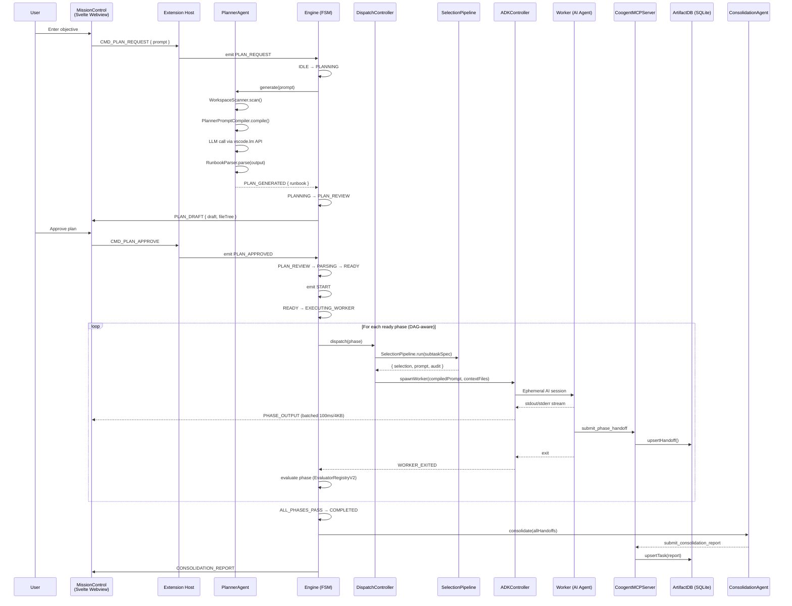

# Architecture & Technical Design

> Coogent system internals: FSM engine, DAG scheduling, MCP server, persistence, and tech stack.

---

## Table of Contents

1. [System Architecture](#system-architecture)
2. [Finite State Machine (Engine)](#finite-state-machine-engine)
3. [DAG-Aware Parallel Scheduling](#dag-aware-parallel-scheduling)
4. [In-Process MCP Server](#in-process-mcp-server)
5. [Context Diffusion Pipeline](#context-diffusion-pipeline)
6. [Context Pack Assembly](#context-pack-assembly)
7. [Worker Output Validation](#worker-output-validation)
8. [Pluggable Evaluator System (V2)](#pluggable-evaluator-system-v2)
9. [Prompt Compiler Pipeline](#prompt-compiler-pipeline)
10. [Agent Registry & Selection Pipeline](#agent-registry--selection-pipeline)
11. [MCP Prompts](#mcp-prompts)
12. [MCP Sampling](#mcp-sampling)
13. [Storage & Path Management](#storage--path-management)
14. [ArtifactDB Backup & Recovery](#artifactdb-backup--recovery)
15. [Engine Decomposition (Post-Refactor)](#engine-decomposition-post-refactor)
16. [PlannerAgent Decomposition](#planneragent-decomposition)
17. [ArtifactDB Repository Layer](#artifactdb-repository-layer)
18. [MCP Plugin System](#mcp-plugin-system)
19. [MCP Validator & Error Codes](#mcp-validator--error-codes)
20. [End-to-End Request Lifecycle](#end-to-end-request-lifecycle)
21. [Webview Architecture](#webview-architecture)
22. [Build Pipeline](#build-pipeline)
23. [Persistence & Crash Recovery](#persistence--crash-recovery)
24. [Git Sandboxing](#git-sandboxing)
25. [Tech Stack](#tech-stack)

---

## System Architecture

```
┌─────────────────────────────────────────────────────────────────────────┐
│                        VS Code Extension Host                          │
│                                                                        │
│  ┌──────────┐  ┌──────────┐  ┌──────────────┐  ┌───────────────────┐  │
│  │  Engine   │  │  State   │  │  Telemetry   │  │   GitSandbox      │  │
│  │  (FSM)   │──│ Manager  │  │   Logger     │  │   Manager         │  │
│  │          │  │ (WAL)    │  │  (JSONL)     │  │  (Branch Iso.)    │  │
│  └────┬─────┘  └──────────┘  └──────────────┘  └───────────────────┘  │
│       │                                                                │
│       ├─── phase:execute ──► ┌──────────────┐                         │
│       │                      │ ADKController │ ──► Ephemeral Workers   │
│       │                      │ (Spawn/Kill)  │     (AI Agent Sessions) │
│       │                      │ OutputBuffer  │     (100ms / 4KB batch) │
│       │                      └──────────────┘                         │
│       │                                                                │
│       ├─── ui:message ─────► ┌──────────────────────────────────────┐  │
│       │                      │ MissionControlPanel (IPC Proxy)      │  │
│       │                      │   ↕ postMessage / onDidReceiveMsg    │  │
│       │                      └──────────────────┬───────────────────┘  │
│       │                                         │                      │
│       └─── data:read ──────► ┌──────────────────┴───────────────────┐  │
│                              │ CoogentMCPServer (In-Process)        │  │
│                              │   Resources: coogent://tasks/...     │  │
│                              │   Tools: submit_phase_handoff, etc.  │  │
│                              │   ┌────────────────────────────────┐ │  │
│                              │   │ ArtifactDB (SQLite via sql.js) │ │  │
│                              │   └────────────────────────────────┘ │  │
│                              └──────────────────────────────────────┘  │
└─────────────────────────────────────────────────────────────────────────┘
                    │ IPC (postMessage)
                    ▼
┌─────────────────────────────────────────────────────────────────────────┐
│                   Svelte 5 Webview (Mission Control)                    │
│                                                                        │
│  ┌──────────────┐  ┌─────────────┐  ┌───────────────────────────────┐  │
│  │  appState     │  │  mcpStore   │  │  Components                   │  │
│  │  ($state)     │  │  ($state    │  │  PlanReview, PhaseDetails,    │  │
│  │  ($derived)   │  │   factory)  │  │  PhaseHeader, PhaseActions,   │  │
│  │  ($effect)    │  │             │  │  PhaseHandoff, Terminal, ...   │  │
│  └──────────────┘  └─────────────┘  └───────────────────────────────┘  │
└─────────────────────────────────────────────────────────────────────────┘
```

### Component Wiring (Decomposed Architecture)

`extension.ts` (~119 lines) is a thin orchestrator that delegates to six extracted modules:

- **`activation.ts`** (~349 lines) — Composable initialization functions: `initializeLogging()`, `createServices()`, `startMCPServer()`, `registerSidebar()`, `wireEventSystems()`, `registerReactiveConfig()`, `registerRunbookWatcher()`, `cleanupOrphanWorkers()`
- **`ServiceContainer`** — Typed registry holding all service instances (replaces 18 module-level `let` variables)
- **`CommandRegistry`** — Registers all 15 VS Code commands via `registerAllCommands()`
- **`EngineWiring`** — Connects Engine ↔ ADK ↔ MCP ↔ Consolidation events
- **`PlannerWiring`** — Connects PlannerAgent ↔ Engine events
- **`agent-selection/`** — `AgentRegistry`, `AgentSelector`, `SelectionPipeline`, `WorkerPromptCompiler`, `PromptValidator`

Key event flows:

- **Engine → Webview**: Engine emits `ui:message` events that `MissionControlPanel` broadcasts to the UI
- **Worker ↔ UI Piping**: ADK worker output is batched via `OutputBufferRegistry` (100ms / 4KB) before broadcasting `PHASE_OUTPUT`
- **Engine ↔ ADK**: `phase:execute` events trigger `ADKController.spawnWorker()`

### Hybrid State Distribution

Coogent uses a two-tier strategy to balance reactivity with IPC efficiency:

- **Push Model** (small state): Lightweight metadata (engine state, phase statuses, token budgets) pushed proactively via `STATE_SNAPSHOT`
- **Pull Model** (large artifacts): Heavy Markdown (plans, reports, handoffs) fetched on-demand via `coogent://` URIs through the MCP IPC bridge

---

## Finite State Machine (Engine)

The `Engine` class implements a strict 9-state FSM governing the entire task lifecycle:

| State | Description |
|---|---|
| `IDLE` | No runbook loaded. Waiting for user action. |
| `PLANNING` | PlannerAgent generating a runbook from user prompt. |
| `PLAN_REVIEW` | AI-generated plan awaiting user approval. |
| `PARSING` | Validating and loading the approved runbook. |
| `READY` | Runbook loaded; phases ready for dispatch. |
| `EXECUTING_WORKER` | One or more workers actively running. |
| `EVALUATING` | Last worker finished; checking success criteria. |
| `ERROR_PAUSED` | Phase failed or worker crashed; halted for user decision. |
| `COMPLETED` | All phases passed. Terminal state. |

### Transition Events (19 `EngineEvent` values)

| Event | Trigger |
|---|---|
| `PLAN_REQUEST` | User submits a prompt |
| `PLAN_GENERATED` | PlannerAgent produces a draft |
| `PLAN_APPROVED` | User approves the plan |
| `PLAN_REJECTED` | User rejects with feedback → re-plan |
| `LOAD_RUNBOOK` | Existing runbook loaded from disk |
| `PARSE_SUCCESS` | Runbook validated and parsed |
| `PARSE_FAILURE` | Validation failed (schema or cycle) |
| `START` | First dispatch of ready phases |
| `RESUME` | Resume after pause (semantically distinct from `START`) |
| `WORKER_EXITED` | Last active worker finished |
| `ALL_PHASES_PASS` | All phases completed successfully |
| `PHASE_PASS` | Current phase passed, more phases remain |
| `PHASE_FAIL` | Phase evaluation failed |
| `WORKER_TIMEOUT` | Worker exceeded time limit |
| `WORKER_CRASH` | Worker process crashed unexpectedly |
| `RETRY` | User or self-healer triggers retry |
| `SKIP_PHASE` | User skips a phase |
| `ABORT` | User aborts the entire run |
| `PAUSE` | Cooperative pause during execution |
| `RESET` | Reset engine to IDLE |

### State Transition Diagram

```
IDLE ──PLAN_REQUEST──► PLANNING ──PLAN_GENERATED──► PLAN_REVIEW ──PLAN_APPROVED──► PARSING
         ▲                ▲                              │                            │
       RESET         PLAN_REJECTED                       │                      PARSE_SUCCESS
         │                                               │                            │
COMPLETED ◄──ALL_PHASES_PASS── EVALUATING ◄──WORKER_EXITED── EXECUTING_WORKER ◄──START── READY
                                   │                                ▲       │
                              PHASE_FAIL                            │       │
                              WORKER_TIMEOUT                  (frontier     │
                              WORKER_CRASH                    dispatch)     │
                                   │                                        │
                                   ▼                                        │
                             ERROR_PAUSED ──RETRY──► READY ─────────────────┘
```

---

## DAG-Aware Parallel Scheduling

When phases define `depends_on` arrays, the `Scheduler` enables concurrent execution.

### Readiness Criteria

A phase is "ready" when:
1. Its status is `pending`
2. ALL dependency phases have reached `completed` status

### AB-1 Strategy (Parallel FSM)

To maintain a deterministic state machine during concurrent execution:

1. **Shared State**: FSM stays in `EXECUTING_WORKER` as long as *any* worker is active (`activeWorkerCount > 0`)
2. **In-Place Evaluation**: When a worker exits, the engine updates phase status directly
3. **Frontier Dispatch**: Phase completion immediately dispatches newly unblocked DAG neighbors
4. **Terminal Transition**: Only transitions to `EVALUATING` when the **last** active worker finishes

### Concurrency Limit

Default: **4 simultaneous workers**. Prevents resource exhaustion.

### Safety Requirements

| Requirement | Detail |
|---|---|
| **Cycle Detection** | Kahn's algorithm validates the DAG on runbook load — cyclic dependencies deadlock |
| **Cancellable Backoff** | Self-healing timers tracked and cancelled on `ABORT`/`RESET` |
| **Strict Transition Guards** | State-modifying methods verify FSM acceptance before proceeding |

---

## In-Process MCP Server

The `CoogentMCPServer` is the single source of truth for all runtime artifacts.

### State Store (ArtifactDB)

Artifacts are persisted in a **SQLite database** (via `sql.js` WASM) managed by `ArtifactDB`:

- **Durability**: Database file (`artifacts.db`) stored under extension-managed storage for cross-session access
- **Schema**: 11 tenant-owned tables + 1 system table, with monotonic `schema_version` tracking (current: v11)
- **In-Memory Cache**: Reads are served from an in-memory `sql.js` instance; writes schedule a debounced flush to disk
- **Multi-Window Safety**: Uses a reload-before-write merge strategy — see [Multi-Window ArtifactDB Concurrency](#multi-window-artifactdb-concurrency)
- **Workspace Tenanting**: All tenant-owned tables include a `workspace_id` column — see [Workspace Identity & Tenanting](#workspace-identity--tenanting)

#### Tables

| Table | Purpose |
|---|---|
| `tasks` | Master task state (summary, execution plan, consolidation report, status, timestamps) |
| `phases` | Per-phase metadata and context |
| `handoffs` | Phase completion artifacts (decisions, modified files, blockers, downstream context) |
| `worker_outputs` | Raw worker stdout/stderr capture |
| `evaluation_results` | Evaluator outcomes (passed, reason, retryPrompt, evaluator type) |
| `healing_attempts` | Self-healing retry records |
| `sessions` | Session history and metadata |
| `phase_logs` | Structured per-phase event log (prompt, request context, exit code, timestamps) |
| `plan_revisions` | Plan revision history for audit trail (draft JSON, raw LLM output, compilation manifest) |
| `selection_audits` | Agent selection decision records |
| `context_manifests` | Context pack assembly manifests for observability (per-phase budget and mode decisions) |
| `schema_version` | Migration version tracking (system table, not tenant-scoped) |

Schema DDL and migration logic are extracted into `ArtifactDBSchema.ts` (`src/mcp/ArtifactDBSchema.ts`). Migrations are idempotent — `initializeSchema()` is safe to call on every database open. Column additions use `ALTER TABLE ADD COLUMN` wrapped in try/catch for idempotency.

```typescript
// Repository pattern (typed data access):
const db = await ArtifactDB.create(dbPath, workspaceId);
db.tasks.upsert(masterTaskId, { summary });    // Write → in-memory + schedule flush
const task = db.tasks.get(masterTaskId);        // Read ← in-memory
db.handoffs.upsert(masterTaskId, phaseId, handoffData);
db.close();                                     // Final synchronous flush + free WASM
```

### Resources (Read)

Exposed via `coogent://` URIs — see [API Reference](api-reference.md).

### Tools (Write)

`submit_phase_handoff`, `submit_execution_plan`, `submit_consolidation_report`, `get_modified_file_content`

---

## Context Diffusion Pipeline

Each phase follows a 5-step pipeline:

| Step | Component | Action |
|---|---|---|
| 1. Planning | `PlannerAgent` | Generates `.task-runbook.json` from user objective |
| 2. Execution | `ADKController` | Spawns ephemeral workers with curated file context |
| 3. Checkpointing | `GitManager` | Creates Git snapshot commits after successful exits |
| 4. Distillation | `HandoffExtractor` / MCP | Extracts decisions, modified files, and blockers |
| 5. Consolidation | `ConsolidationAgent` | Aggregates all phase handoffs into a final report |

### Context Scoping

The `ContextScoper` prepares minimal file payloads for workers:

- **Discovery**: Reads paths from the runbook phase `context_files` (with AST-based import resolution via `ASTFileResolver`)
- **Guards**: File existence checks + binary detection (null-byte heuristic in first 8KB)
- **Secrets Detection**: `SecretsGuard` scans file content for API keys (AWS, OpenAI, Stripe, Google, JWT), private keys, `.env` patterns, and high-entropy strings (Shannon entropy > 4.5). Detected secrets are redacted with `[REDACTED]`
- **Repo Map**: `RepoMap` generates a lightweight directory listing (~500 tokens) prepended to the file payload, giving workers structural awareness of the repository
- **Formatting**: Each file wrapped in `<<<FILE: path>>>\n{content}\n<<<END FILE>>>`
- **Budget Enforcement**: If assembled payload exceeds `coogent.tokenLimit`, execution halts with user notification
- **Output Scanning**: Worker output streams are scanned by `SecretsGuard` and redacted before broadcasting to the UI
- **Output Batching**: Worker output streams through `OutputBufferRegistry` (100ms timer / 4KB buffer, 1MB upper bound) to prevent IPC channel saturation

### Tokenizers

| Version | Tokenizer | Method |
|---|---|---|
| V1 (current, default) | `TiktokenEncoder` | Model-accurate via `js-tiktoken` WASM (`cl100k_base`), lazy-initialized |
| V1 (fallback) | `CharRatioEncoder` | Fast, dependency-free (~4 chars/token) — used if tiktoken init fails |

### PromptTemplateManager

`PromptTemplateManager` (~440 lines) dynamically discovers the workspace's tech stack from manifest files and injects contextual variables into the Planner's system prompt.

- **Tech Stack Discovery**: Scans root-level manifests (`package.json`, `requirements.txt`, `pyproject.toml`, `go.mod`, `Cargo.toml`) — no directory walking
- **Framework Detection**: Maps dependencies to known frameworks (React, Next.js, Django, FastAPI, Gin, Actix, etc.)
- **Prompt Injection**: Inserts `## Workspace Tech Stack` and `## Available Worker Skills` sections into the planner prompt before the `## User Request` marker
- **Graceful Fallback**: Missing or unreadable manifests are silently skipped; returns sensible defaults

### TokenPruner

`TokenPruner` (~210 lines) implements heuristic strategies for reducing over-budget context payloads to fit within the configured token limit.

**3-tier pruning strategy (in priority order):**

1. **Drop discovered files**: Remove non-explicit (auto-discovered) files by size, largest first
2. **Strip function bodies**: Keep signatures only, using brace-counting heuristic for C-family and Swift
3. **Truncate large files**: Apply a per-file token cap to remaining entries

The pruner is best-effort — callers must check `PruneResult.withinBudget` after pruning.

---

## Context Pack Assembly

The `ContextPackBuilder` and `FileContextModeSelector` work together to assemble minimal, budget-aware context payloads for each phase worker.

### ContextPackBuilder — 6-Step Pipeline

`ContextPackBuilder` (~456 lines, `src/context/ContextPackBuilder.ts`) orchestrates context assembly through a deterministic pipeline:

| Step | Action |
|---|---|
| 1. Collect upstream handoffs | Loads handoff data from completed dependency phases via ArtifactDB |
| 2. Identify target files | Resolves explicit `context_files` and upstream-modified files |
| 3. Choose file context mode | Delegates to `FileContextModeSelector` for per-file granularity |
| 4. Materialize file context | Reads and formats file content based on the selected mode |
| 5. Prune to budget | Applies `TokenPruner` if assembled payload exceeds the token limit |
| 6. Build manifest | Generates an audit manifest recording mode decisions and token counts |

The builder produces a `ContextPack` containing the formatted file payloads, upstream handoff summaries, and a `ContextManifest` for observability.

### FileContextModeSelector — 4 Context Modes

`FileContextModeSelector` (~178 lines, `src/context/FileContextModeSelector.ts`) is a heuristic engine that decides how much of each file to include:

| Mode | Description | When Selected |
|---|---|---|
| **Full** | Entire file content | Small files (<500 lines), full-semantics phases, small same-file continuations |
| **Slice** | Function/class signatures + surrounding context | Medium files where full mode exceeds 40% of token budget |
| **Patch** | Upstream diff/patch only | File modified by a dependency phase (awareness-only inclusion) |
| **Metadata** | Path + size + language only | Default fallback when no other mode applies |

V2 enhancement: when a token budget is provided, the selector estimates the cost of `full` mode using the token encoder and downgrades to `slice` if it would exceed 40% of the budget.

---

## Worker Output Validation

`WorkerOutputValidator` (~201 lines, `src/engine/WorkerOutputValidator.ts`) enforces **fail-closed** validation on all worker output before it enters the persistence layer.

### Contract Types

| Contract | Schema | Purpose |
|---|---|---|
| `phase_handoff` | `PhaseHandoffSchema` | Validates decisions, modified files, blockers submitted via `submit_phase_handoff` |
| `execution_plan` | `ImplementationPlanSchema` | Validates markdown plans submitted via `submit_execution_plan` |
| `consolidation_report` | `ConsolidationReportSchema` | Validates final markdown reports (max 512 KB) |
| `fit_assessment` | `FitAssessmentSchema` | Validates optional worker metadata / skill-match scores |

### Validation Semantics

- **Null/undefined input** → immediate failure (`WORKER_OUTPUT_NULL_INPUT`)
- **Schema violation** → failure with Zod issue details (`WORKER_OUTPUT_INVALID_FIT`)
- **Unexpected exception** → failure caught and wrapped (`WORKER_OUTPUT_UNEXPECTED_ERROR`)
- Returns a discriminated union: `{ success: true, data }` or `{ success: false, error }`

All schemas use Zod with explicit `.max()` bounds on strings and arrays to prevent unbounded payloads.

---

## Pluggable Evaluator System (V2)

The `EvaluatorRegistryV2` implements the **Strategy pattern** for phase success evaluation.

### Evaluator Types

| Type | Criteria Format | Behavior |
|---|---|---|
| `exit_code` | `exit_code:N` | Match worker process exit code (default: 0) |
| `regex` | `regex:<pattern>` or `regex_fail:<pattern>` | Match/reject stdout against a regular expression |
| `toolchain` | `toolchain:<cmd>` | Run a whitelisted binary via `execFile` (no shell) |
| `test_suite` | `test_suite:<cmd>` | Run a test command, parse pass/fail results |

All evaluators return `EvaluationResult { passed, reason, retryPrompt? }`. The optional `retryPrompt` integrates with `SelfHealingController.buildHealingPromptWithContext()` for intelligent retry feedback.

### Composite Evaluation

Phases may define a `evaluators: EvaluatorType[]` array for multi-evaluator assessment. The Engine runs all evaluators in sequence using **fail-fast** semantics — the first failure halts evaluation and aggregates `retryPrompt` strings. When `evaluators` is absent, the single `evaluator` field is used (defaulting to `exit_code`).

### Security Boundaries

- **Binary Whitelist**: `TOOLCHAIN_WHITELIST` restricts executable binaries to `node`, `npm`, `npx`, `python`, `python3`, `cargo`, `go`, `make`
- **Argument Blacklist**: Interpreter binaries (`node`, `python`, `python3`) block `-e`, `-c`, `--eval`, `exec` flags to prevent arbitrary code execution
- **Strict Timeouts**: All evaluator child processes enforce configurable timeouts
- **`execFile`**: All subprocess calls use `execFile` (no shell interpolation)

---

## Prompt Compiler Pipeline

The `src/prompt-compiler/` subsystem (23 items) transforms raw user prompts into fully assembled, auditable master prompts for the Planner agent.

### Architecture

```
Raw User Prompt → PlannerPromptCompiler.compile(prompt, options)
                          │
                          ├─ Step 1: RequirementNormalizer.normalize(prompt)
                          │   └─ Extracts scope, autonomy prefs, constraints
                          │
                          ├─ Step 2: TaskClassifier.classify(normalizedSpec)
                          │   └─ Determines TaskFamily (feature, bug-fix, refactor, etc.)
                          │
                          ├─ Step 3: TemplateLoader.load(taskFamily)
                          │   └─ Loads family-specific prompt template
                          │
                          ├─ Step 4: RepoFingerprinter.fingerprint(workspaceRoot)
                          │   └─ Scans repo structure, tech stack, conventions
                          │
                          ├─ Step 5: PolicyEngine.evaluate(normalizedSpec)
                          │   └─ Applies policy modules (safety, style, scope)
                          │
                          └─ Step 6: assemblePrompt() → CompiledPrompt
                              └─ Merges skeleton, template, fingerprint, policies
```

### Modules

| Module | Lines | Purpose |
|---|---|---|
| `PlannerPromptCompiler` | ~325 | Top-level orchestrator, runs all pipeline stages |
| `RequirementNormalizer` | ~271 | Extracts structured `NormalizedTaskSpec` from raw text |
| `TaskClassifier` | ~139 | Maps normalized specs to `TaskFamily` enum |
| `TemplateLoader` | ~86 | Loads Markdown templates from `templates/` (inlined at build time) |
| `RepoFingerprinter` | ~623 | Scans workspace for tech stack, file patterns, conventions |
| `PolicyEngine` | ~217 | Evaluates and applies policy modules to the prompt |
| `types.ts` | ~189 | Shared type definitions (`TaskFamily`, `RepoFingerprint`, `CompiledPrompt`, etc.) |
| `templates.ts` | ~25 | Template registry mapping task families to template IDs |

### Prompt Templates

8 family-specific Markdown templates in `prompt-compiler/templates/`:

| Template | Task Family |
|---|---|
| `feature-implementation.md` | New feature development |
| `bug-fix.md` | Bug investigation and fixing |
| `refactor.md` | Code refactoring |
| `migration.md` | Framework/version migration |
| `documentation-synthesis.md` | Documentation writing |
| `review-only.md` | Code review and analysis |
| `repo-analysis.md` | Repository structure analysis |
| `orchestration-skeleton.md` | Multi-phase task orchestration |

Templates are **inlined at build time** via esbuild's text loader to ensure portability in the bundled VSIX.

---

## Agent Registry & Selection Pipeline

The `agent-selection/` module replaces the legacy `WorkerRegistry` with a structured, auditable pipeline for matching subtasks to specialized agent profiles.

### Architecture Overview

```
SubtaskSpec → SelectionPipeline.run(spec)
                   │
                   ├─ Step 1: AgentSelector.select(spec)
                   │   ├─ Hard Filter  (reject incompatible agents)
                   │   ├─ Weighted Scoring (7 weighted dimensions)
                   │   ├─ Tie-Break (prefer simpler/default agents)
                   │   └─ Fallback (code_editor generalist)
                   │
                   ├─ Step 2: WorkerPromptCompiler.compile(spec, profile)
                   │   ├─ Load base-worker.md template
                   │   ├─ Load agent-specific template (e.g. CodeEditor.md)
                   │   └─ Interpolate {{placeholders}} with spec data
                   │
                   ├─ Step 3: PromptValidator.validate(prompt, spec)
                   │   └─ Structural validation (length, required sections)
                   │
                   └─ Step 4: Build SelectionAuditRecord → ArtifactDB
```

### AgentRegistry — Three-Level Cascading Configuration

Agent profiles are loaded and merged in priority order:

| Priority | Source | Location |
|---|---|---|
| 1 (lowest) | Built-in defaults | `agent-selection/registry.json` |
| 2 | VS Code settings | `coogent.customWorkers` |
| 3 (highest) | Workspace file | `.coogent/workers.json` |

Higher-priority profiles with matching `id` values override lower-priority ones. Non-overlapping profiles are merged into a single collection.

### AgentSelector — Four-Pass Algorithm

1. **Hard Filter**: Reject agents whose `handles` array excludes the task type, or whose `avoid_when` keywords match the subtask
2. **Weighted Scoring**: Seven weighted dimensions:

| Dimension | Weight | Description |
|---|---|---|
| `task_type_match` | 4 | Does the agent handle this task type? |
| `reasoning_type_match` | 3 | Does the reasoning style match? |
| `skill_match` | 2 | Proportion overlap of required vs. available skills |
| `context_fit` | 3 | Context window and input format compatibility |
| `output_fit` | 2 | Deliverable type compatibility |
| `risk_fit` | 2 | Risk tolerance alignment (exact=1.0, ±1 tier=0.5) |
| `avoid_when_penalty` | 6 | Negative weight for matching avoid keywords |

3. **Tie-Break**: When top two candidates score identically, prefer the simpler/default agent
4. **Fallback**: If no candidate passes the hard filter, use the `code_editor` generalist profile

### Prompt Templates

Templates live in `agent-selection/templates/`:

| Template | Purpose |
|---|---|
| `base-worker.md` | Common preamble for all agents |
| `CodeEditor.md` | Code editing and implementation |
| `Debugger.md` | Bug investigation and fixing |
| `Planner.md` | Task decomposition and planning |
| `Researcher.md` | Information gathering and analysis |
| `Reviewer.md` | Code review and quality assessment |
| `TestWriter.md` | Test creation and validation |

### Data Flow

```
User Prompt → PlannerAgent
                │
                ├── AgentRegistry.getAvailableTags() → Injects skill tags into planner prompt
                │
                └── Generates phases with required_capabilities: [...]
                                │
                                ▼
                          DispatchController
                                │
                                ├── SelectionPipeline.run(subtaskSpec)
                                │        │
                                │        └── PipelineResult { selection, prompt, validation, audit }
                                │
                                └── ADKController.spawnWorker()
                                         │
                                         └── Injects compiled prompt
                                             into the AI agent session
```

### Worker Studio UI

The Mission Control webview includes a **Workers** tab that displays all loaded profiles:

- Profile name and unique ID
- Description of capabilities
- Skill tags (used for selection scoring)

The tab sends `workers:request` → receives `workers:loaded` via the standard IPC contract.

---

## MCP Prompts

`MCPPromptHandler` (~318 lines, `src/mcp/MCPPromptHandler.ts`) exposes Coogent's internal workflows as discoverable MCP Prompts. This allows MCP clients to invoke structured prompt templates without knowing the internal prompt format.

### Registered Prompts

| Prompt | Arguments | Purpose |
|---|---|---|
| `plan_repo_task` | `objective`, `workspace_root`, `tech_stack` | Generate a phased implementation plan with DAG dependencies and success criteria |
| `review_generated_runbook` | `runbook_json`, `risk_tolerance` | Review and validate an AI-generated runbook for completeness and safety |
| `repair_failed_phase` | `phase_id`, `failure_reason`, `prior_output` | Diagnose and repair a failed phase with contextual analysis |
| `consolidate_session` | `session_id`, `unresolved_issues` | Aggregate all phase handoffs into a final session report |
| `architecture_review_workspace` | `workspace_root`, `focus_areas`, `output_style` | Review workspace architecture, identifying strengths, risks, and improvements |

Each prompt includes a `_version` metadata field (currently `1.0.0`) for contract tracking. Prompt invocations are logged via the standard logger.

---

## MCP Sampling

`SamplingProvider` (~154 lines, `src/mcp/SamplingProvider.ts`) provides a feature-flagged abstraction for requesting LLM inference via MCP Sampling.

### Architecture

| Class | Behavior |
|---|---|
| `SamplingProvider` (interface) | Abstract contract with `isAvailable()` and `sample()` methods |
| `NoopSamplingProvider` | Always reports unavailable; callers must fall back to non-sampling behavior |
| `MCPSamplingProvider` | Delegates to the MCP Server's `createMessage` API when the client advertises sampling support |

### Constraints

- **Feature-gated**: Controlled by `coogent.enableSampling` VS Code setting
- **Never for control-plane logic**: Sampling must not be used for deterministic decisions (routing, scheduling, state transitions)
- **Logged**: All invocations are logged with request class, model metadata, outcome, and token usage
- **Availability check**: `MCPSamplingProvider.isAvailable()` checks `capabilities.sampling` from the MCP client handshake

---

## Storage & Path Management

`StorageBase` (~117 lines, `src/constants/StorageBase.ts`) is the **unified hybrid storage-path abstraction** that routes durable artifacts to the global Antigravity directory and operational state to the workspace-local `.coogent/` directory.

### Path Resolution Strategy (Hybrid Model)

| Data Category | Base Path |
|---|---|
| Durable (DB, backups) | `~/Library/Application Support/Antigravity/coogent/` (global) |
| Operational (IPC, logs, sessions) | `<workspaceRoot>/.coogent/` (workspace-local) |

### Derived Paths

| Method | Path | Category |
|---|---|---|
| `getDurableBase()` | Global durable storage root | Global |
| `getDBPath()` | SQLite database file (`artifacts.db`) | Global |
| `getBackupDir()` | Backup snapshots directory | Global |
| `getWorkspaceBase()` | Workspace-local operational storage root | Local |
| `getLogsDir()` | JSONL log directory | Local |
| `getSessionDir(id)` | Per-session data directory | Local |
| `getIPCDir()` | Workspace IPC root directory | Local |
| `getWorkspaceId()` | Tenant identity (SHA-256 prefix) | Identity |

All methods are **deterministic and stateless** — pure path computation with no filesystem side-effects. Use the `createStorageBase()` factory for dependency injection.

---

## ArtifactDB Backup & Recovery

The database uses **two complementary backup mechanisms**:

### 1. Integrated Periodic Backup (`ArtifactDB.backupIfDue()`)

After every successful flush, `ArtifactDB` checks whether enough time has elapsed (5-minute minimum interval) and creates a timestamped backup alongside the database file. Files are named `artifacts.db.backup-<epoch_ms>` and at most 3 are retained.

- Triggered automatically — no user action required
- Uses atomic copy (write to `.tmp`, then `rename`)
- Best-effort — failures are logged but never thrown
- Pruning deletes oldest backups beyond `MAX_BACKUPS` (3)

### 2. Explicit Snapshot/Restore (`ArtifactDBBackup`)

`ArtifactDBBackup` (~148 lines, `src/mcp/ArtifactDBBackup.ts`) provides an on-demand API for manual backup management.

| Method | Behavior |
|---|---|
| `createSnapshot()` | Atomic copy (write to `.tmp`, then `fs.rename`) with ISO-timestamp naming |
| `rotateBackups(n)` | Retains only the N most recent backups (default: 3), deletes oldest first |
| `getLatestBackup()` | Returns the path to the newest backup, or `null` |
| `restoreFromBackup(path)` | Atomic restore: copies backup to `.tmp` adjacent to DB path, then renames into place |

### Safety Properties

- **Atomic writes**: All writes use temp-file + rename to prevent partial files on crash
- **Lexicographic sorting**: Timestamp-based filenames sort chronologically
- **Best-effort rotation**: Delete failures are silently caught to avoid blocking on stale files
- **Post-restore restart**: After restore, the in-memory `sql.js` instance must be reloaded (logged as a warning)

For the backup/recovery runbook, see [Operations — Backup & Recovery](operations.md#backup--recovery-runbook).

---

## Persistence & Crash Recovery

### Write-Ahead Log (WAL) Pattern

Every mutation follows this sequence (within `storageBase/ipc/<sessionDirName>/`, rooted under extension-managed storage):

1. **Acquire Lock** — `.lock` file via `wx` flag (O_CREAT | O_EXCL)
2. **Write WAL Entry** — Snapshot to `.wal.json`
3. **Write to Temp** — Data to `.task-runbook.json.tmp`
4. **Atomic Rename** — Move `.tmp` over the real file
5. **Remove WAL** — Delete journal entry
6. **Release Lock**

### Crash Recovery

On activation, `StateManager` checks for `.wal.json`. If found:
1. Reads the WAL snapshot
2. Re-applies to the runbook file
3. Cleans up the WAL
4. Transitions engine to `ERROR_PAUSED`

### Schema Validation

AJV validates the runbook schema on every disk load. The schema is **inlined as a TypeScript constant** (not read from file) to survive esbuild single-file bundling.

---

## Git Sandboxing

### Pre-Flight Check

Before execution, `GitSandboxManager` checks for uncommitted changes:

- **Clean tree**: Sandbox branch created automatically (`coogent/<task-slug>`)
- **Dirty tree**: User prompted to commit/stash or explicitly bypass

### Sandbox Properties

- Branch created once per session (tracked via `branchCreated` flag)
- Always branches from current HEAD
- No automatic rebase/merge — user controls via PR or manual commit
- Pre-flight check uses VS Code Git API (non-destructive, no disk modification)

---

## Multi-Root Workspace Support

Coogent fully supports VS Code [multi-root workspaces](https://code.visualstudio.com/docs/editor/multi-root-workspaces), where multiple top-level folders are open simultaneously.

### State Storage Isolation

Session state and artifacts are stored in **extension-managed storage** (`ExtensionContext.storageUri`) rather than inside any workspace folder:

- The `.coogent/` directory is no longer created in the workspace root.
- `ArtifactDB`, WAL files, and session data live under the extension's `storageUri`, typically `~/.vscode/extensions/storage/coogent/`.
- This prevents state collisions when multiple workspace roots share the same parent directory.

### Cross-Root File Resolution

The `ExplicitFileResolver` and `ASTFileResolver` probe **all workspace roots** when resolving relative paths specified in runbook `context_files`:

1. **Exact match** — If the path exists under one root, use it.
2. **Multi-match** — If multiple roots contain the same relative path, the **primary root** (first workspace folder) wins. A warning is logged.
3. **No match** — The path is skipped with an error logged.

`WorkspaceHelper.resolveFileAcrossRoots(relativePath)` centralizes this logic.

### Multi-Repo Git Sandboxing

`GitSandboxManager` provides multi-repo methods alongside the existing single-repo API:

| Method | Scope | Behavior |
|---|---|---|
| `preFlightCheck()` | Single repo (best-match) | Returns clean/dirty for the matched repository |
| `preFlightCheckAll()` | All repos | Returns per-repo clean/dirty status + aggregate `allClean` flag |
| `createSandboxBranch()` | Single repo | Creates `coogent/<task-slug>` on the matched repository |
| `createSandboxBranchAll()` | All repos | Two-phase commit: preflight all → create branch in each repo with consistent naming |
| `returnToOriginalBranchAll()` | All repos | Checks out original branches for each repository |

Branch naming is **consistent** across all repositories: `coogent/<sanitized-task-slug>`.

If one repository fails during `createSandboxBranchAll`, the result reports which repos succeeded and which failed — there is **no automatic rollback**.

### Workspace-Qualified Paths

To unambiguously reference files across roots, Coogent supports a **workspace-qualified path** format:

```
<workspaceName>:relative/path/to/file.ts
```

For example, in a workspace with roots `frontend` and `backend`:
- `frontend:src/App.tsx` — resolves to the `src/App.tsx` file under the `frontend` root
- `backend:src/server.ts` — resolves to `src/server.ts` under the `backend` root

`WorkspaceHelper.parseQualifiedPath()` and `WorkspaceHelper.resolveQualifiedPath()` handle parsing and resolution.

### Ambiguity Handling Rules

| Scenario | Resolution |
|---|---|
| Path found in exactly one root | Use that root |
| Path found in multiple roots | Primary root (first workspace folder) wins; warning logged |
| Qualified path provided | Exact root used; error if root name not found |
| Path found in no root | Error logged; file skipped |

---

## Engine Decomposition (Post-Refactor)

The `EngineWiring` module delegates its `executePhase` logic to three focused collaborator classes, extracted in the March 2026 refactor:

| Class | File | Responsibility |
|---|---|---|
| `ContextAssemblyAdapter` | `src/engine/ContextAssemblyAdapter.ts` | Delegates context assembly to `ContextPackBuilder`, transforms the result into the format expected by the worker launcher |
| `WorkerLauncher` | `src/engine/WorkerLauncher.ts` | Handles worker spawning via `ADKController`, including prompt compilation, timeout management, and output bridge setup |
| `WorkerResultProcessor` | `src/engine/WorkerResultProcessor.ts` | Processes worker exit results — validates output via `WorkerOutputValidator`, persists handoffs, triggers evaluation |

These collaborators are instantiated by `EngineWiring` and injected with their dependencies. The public API of `EngineWiring` remains unchanged — callers still call `wireEngine()` and the collaborators are internal implementation details.

### Decomposition Pattern

```
EngineWiring.wireEngine()
    │
    ├── on 'phase:execute' ──► ContextAssemblyAdapter.assemble()
    │                              └── ContextPackBuilder.build()
    │
    ├── ──────────────────────► WorkerLauncher.launch()
    │                              ├── SelectionPipeline.run()
    │                              └── ADKController.spawnWorker()
    │
    └── on 'worker:exit' ────► WorkerResultProcessor.process()
                                   ├── WorkerOutputValidator.validate()
                                   └── ArtifactDB.upsertHandoff()
```

---

## PlannerAgent Decomposition

The `PlannerAgent` class (`src/planner/PlannerAgent.ts`) has been decomposed into three collaborators via dependency injection:

| Class | File | Responsibility |
|---|---|---|
| `WorkspaceScanner` | `src/planner/WorkspaceScanner.ts` | Scans workspace filesystem structure (file tree, tech stack detection) to provide context for plan generation |
| `RunbookParser` | `src/planner/RunbookParser.ts` | Parses and validates raw LLM output into structured `Runbook` objects, handling JSON extraction from markdown fences |
| `PlannerRetryManager` | `src/planner/PlannerRetryManager.ts` | Manages retry logic for planner failures with feedback injection and configurable retry limits |

`PlannerAgent` retains backward-compatible wrapper methods for each delegated responsibility. The collaborators are injected via constructor, enabling isolated unit testing.

---

## ArtifactDB Repository Layer

The `src/mcp/repositories/` directory provides a **typed repository layer** over the raw `ArtifactDB` SQLite interface. Each repository encapsulates queries and mutations for a specific domain:

| Repository | Purpose |
|---|---|
| `TaskRepository` | Master task CRUD: summary, execution plan, consolidation report |
| `PhaseRepository` | Phase metadata, status transitions, context |
| `HandoffRepository` | Phase completion artifacts (decisions, modified files, blockers) |
| `SessionRepository` | Session history, metadata, and lifecycle |
| `AuditRepository` | Agent selection audit trail records |
| `VerdictRepository` | Evaluation results (passed/failed, reason, retryPrompt) |
| `ContextManifestRepository` | Context pack manifests for observability |

Shared types are defined in `db-types.ts`. All repositories receive the `ArtifactDB` instance via constructor injection and use type-safe query methods rather than raw SQL strings.

---

## Session History Services

The `src/session/` module provides a layered service architecture for session lifecycle management, built on top of `SessionManager` and `ArtifactDB`.

### Service Architecture

```
SessionHistoryService (Unified Facade)
  ├── SessionManager        (list, search, create, prune)
  ├── SessionRestoreService (load + reconstruct)
  │     └── SessionHealthValidator (pre-load health check)
  └── SessionDeleteService  (cascade delete)
```

### Components

| Service | File | Responsibility |
|---|---|---|
| `SessionManager` | `src/session/SessionManager.ts` | Session discovery (DB-first with IPC fallback), listing, full-text search, pruning, and directory management. Uses UUIDv7 session IDs with `YYYYMMDD-HHMMSS-<uuid>` directory naming. |
| `SessionHealthValidator` | `src/session/SessionHealthValidator.ts` | Pre-load validation of session integrity. Checks metadata in `SessionRepository`, directory existence on disk, and runbook availability (file or ArtifactDB). Reports `healthy`, `degraded`, or `invalid` status. |
| `SessionRestoreService` | `src/session/SessionRestoreService.ts` | Deterministic session restoration. Validates health via `SessionHealthValidator`, reconstructs `StateManager` and MCP `TaskState`, and restores worker outputs from ArtifactDB. Returns a structured `SessionRestoreResult`. |
| `SessionDeleteService` | `src/session/SessionDeleteService.ts` | Controlled cascade deletion: clears active MCP task state → deletes session files and database records via `SessionManager` → purges associated artifacts from ArtifactDB. Handles errors at each step gracefully. |
| `SessionHistoryService` | `src/session/SessionHistoryService.ts` | Unified orchestration facade for all session history operations. Delegates to `SessionManager` (list, search), `SessionRestoreService` (load), and `SessionDeleteService` (delete). Updates the current session ID on successful load. |

### Data Flow

When a user loads a session via the sidebar or `CMD_LOAD_SESSION`:

1. `SessionHistoryService.loadSession(sessionId)` is called
2. `SessionRestoreService.restore(sessionId)` validates health and reconstructs state
3. `SessionHealthValidator.validate(sessionId)` checks metadata, directory, and runbook
4. On success, `SessionHistoryService` updates `ServiceContainer.currentSessionId`
5. Engine transitions are replayed from the restored `StateManager`

When a user deletes a session:

1. `SessionHistoryService.deleteSession(sessionId)` is called
2. `SessionDeleteService` checks if the session is currently active
3. If active, clears MCP task state first
4. Deletes session directory and database records
5. Returns `SessionDeleteResult` with success status and any errors

---

## MCP Plugin System

The MCP server supports an extensible plugin architecture for adding custom resources and tools:

| Component | File | Purpose |
|---|---|---|
| `MCPPlugin` | `src/mcp/MCPPlugin.ts` | Interface definition for MCP plugins (resources, tools, lifecycle hooks) |
| `PluginLoader` | `src/mcp/PluginLoader.ts` | Discovers, validates, and loads plugins with configurable approval gates |

### Plugin Lifecycle

1. **Discovery**: `PluginLoader` scans for plugin declarations
2. **Approval Gate**: If `coogent.requirePluginApproval` is `true` (default), the user must approve each plugin before activation
3. **Registration**: Approved plugins register their resources and tools with the MCP server
4. **Teardown**: Plugins are deactivated on extension deactivation

---

## MCP Validator & Error Codes

### MCPValidator

`MCPValidator` (`src/mcp/MCPValidator.ts`) provides **input validation** at the MCP server boundary:

- Validates resource URI format against expected patterns
- Validates tool input schemas before handler execution
- Rejects path traversal attempts (e.g., `../../../etc/passwd`) with `PATH_TRAVERSAL` error code
- Returns structured error responses with canonical error codes

### Canonical Error Codes

`ErrorCodes` (`src/constants/index.ts`) defines string constants used across all boundary failure sites:

| Code | Boundary | Meaning |
|---|---|---|
| `WORKER_OUTPUT_NULL_INPUT` | WorkerOutputValidator | Null/undefined input to validator |
| `WORKER_OUTPUT_INVALID_FIT` | WorkerOutputValidator | Zod schema violation |
| `WORKER_OUTPUT_UNEXPECTED_ERROR` | WorkerOutputValidator | Unhandled exception during validation |
| `PATH_TRAVERSAL` | MCPValidator | Path traversal attempt detected |
| `MCP_TOOL_INVALID_INPUT` | MCPToolHandler | Invalid tool input schema |
| `MCP_RESOURCE_NOT_FOUND` | MCPResourceHandler | Requested URI not found |
| `DISPATCH_VALIDATION_FAILED` | DispatchController | Worker output failed validation before persistence |

All error codes are logged via `TelemetryLogger.logBoundaryEvent()` for structured observability.

---

## End-to-End Request Lifecycle

The following diagram shows the complete request flow from user prompt to consolidated report:



### Key Flow Properties

| Property | Detail |
|---|---|
| **Parallelism** | Independent phases (no `depends_on` edges) dispatch concurrently, up to `maxConcurrentWorkers` |
| **Frontier dispatch** | When a worker exits successfully, newly unblocked DAG neighbors dispatch immediately |
| **Self-healing** | Failed phases retry with error feedback injected into the retry prompt (up to `maxRetries`) |
| **State persistence** | Every mutation is written to the WAL before applying, enabling crash recovery |
| **Context isolation** | Each worker receives exactly the files listed in its phase `context_files` — no shared state between workers |

---

## Webview Architecture

The Mission Control UI (`webview-ui/`) is a **Svelte 5** single-page application communicating with the Extension Host via `postMessage` IPC.

### Store Architecture

| Store | File | Pattern | Purpose |
|---|---|---|---|
| `appState` | `stores/appState.ts` | `$state` / `$derived` | Reactive projection of engine state, phases, and UI mode |
| `mcpStore` | `stores/mcpStore.ts` | Request-correlation factory | On-demand data fetching via `coogent://` URIs with requestId tracking |

#### `mcpStore` — IPC Correlation Pattern

Heavy Markdown artifacts (plans, reports, handoffs) are _not_ pushed proactively. Instead, the webview fetches them on-demand:

1. **Request**: Component calls `mcpStore.fetch(uri)` → generates a unique `requestId` → sends `MCP_FETCH_RESOURCE { uri, requestId }` to the Extension Host
2. **Proxy**: Extension Host reads the resource from `CoogentMCPServer` (backed by `ArtifactDB`)
3. **Response**: Extension Host sends `MCP_RESOURCE_DATA { requestId, data }` back
4. **Correlation**: `mcpStore` matches the `requestId` and resolves the pending promise

This avoids saturating the IPC channel with large payloads on every state change.

### Component Structure

```
webview-ui/src/
├── App.svelte                    ← Root: tab navigation, theme sync
├── components/
│   ├── ChatInput.svelte          ← User prompt input with @mentions and /commands
│   ├── ExecutionControls.svelte  ← Start/pause/abort controls
│   ├── GlobalHeader.svelte       ← Top header bar with session info
│   ├── InputToolbar.svelte       ← Input area toolbar (file/image attach)
│   ├── MarkdownRenderer.svelte   ← Rendered markdown with mermaid diagrams
│   ├── PhaseActions.svelte       ← Retry/skip/stop/restart buttons
│   ├── PhaseDetails.svelte       ← Per-phase status, output, handoff
│   ├── PhaseHandoff.svelte       ← Handoff artifact display
│   ├── PhaseHeader.svelte        ← Phase title, status badge, timing
│   ├── PhaseNavigator.svelte     ← Phase list navigation sidebar
│   ├── PlanReview.svelte         ← Plan display and approval UI
│   ├── ReportModal.svelte        ← Consolidation report modal
│   ├── SuggestionPopup.svelte    ← @mention and /command suggestion popup
│   ├── ViewModeTabs.svelte       ← View mode tab selector
│   ├── WorkerStudio.svelte       ← Worker profile browser
│   └── WorkerTerminal.svelte     ← Real-time worker output stream
├── lib/                          ← Shared utilities
├── stores/
│   ├── appState.ts               ← Global reactive state ($state/$derived)
│   └── mcpStore.ts               ← IPC fetch-with-correlation
├── styles/                       ← Global CSS
└── types.ts                      ← Frontend type definitions
```

### Theme Parity

The webview achieves **pixel-perfect theme parity** with the IDE by reading VS Code CSS custom properties (`--vscode-editor-background`, `--vscode-editor-foreground`, etc.) directly. No separate theme file is maintained.

---

## Build Pipeline

### Two-Target Architecture

| Target | Bundler | Entry | Output | Format |
|---|---|---|---|---|
| Extension Host | esbuild | `src/extension.ts` | `out/extension.js` | CommonJS (Node.js) |
| Webview UI | Vite + Svelte | `webview-ui/src/main.ts` | `webview-ui/dist/` | ESM (Browser) |

### esbuild Configuration (`esbuild.js`)

| Feature | Detail |
|---|---|
| **Template inlining** | `.md` files loaded as text strings — ensures prompt templates survive single-file bundling |
| **WASM handling** | `sql-wasm.wasm` copied alongside the output bundle for `sql.js` runtime loading |
| **Externals** | `vscode` excluded — provided by the Extension Host runtime |
| **Schema inlining** | Runbook JSON Schema inlined as a TypeScript constant (not loaded from file) to prevent ENOENT in VSIX |

### VSIX Packaging

```bash
npm run prepackage   # esbuild --minify + Vite build
npm run package      # npx @vscode/vsce package → coogent-<version>.vsix
```

The `.vscodeignore` file excludes `src/`, `node_modules/`, `webview-ui/src/`, and test files from the package. The VSIX contains only `out/extension.js`, `webview-ui/dist/`, schemas, and metadata.

---

## Tech Stack

| Layer | Technology |
|---|---|
| Language | TypeScript 5.4 (strict mode) |
| Runtime | Node.js 18+ (VS Code Extension Host) |
| IDE | Antigravity IDE / VS Code ≥ 1.85 |
| MCP | `@modelcontextprotocol/sdk` ^1.27 |
| Persistence | `sql.js` (SQLite WASM) via `ArtifactDB` (11 tenant-owned tables + schema_version) |
| Tokenizer | `js-tiktoken` (`cl100k_base`) with `CharRatioEncoder` fallback |
| Schema Validation | AJV ^8.18 (inlined), Zod ^4.3 (handoff validation) |
| Markdown | `marked` ^17.0 |
| Diagrams | `mermaid` ^11.12 |
| UI | Svelte 5 + Vite (16 components) |
| Bundler (Host) | esbuild ^0.20 |
| Testing (Host) | Jest ^29.7 + ts-jest (89 test files) |
| Testing (Webview) | Vitest (24 test files) |
| Linting | ESLint ^8.57 + `@typescript-eslint` ^8.0 |
| Pre-commit | Husky ^9.1 + lint-staged ^16.3 |
| CI/CD | GitHub Actions (Node 18/20 matrix, ubuntu-latest) |

### Key Architecture Decisions

| Decision | Rationale |
|---|---|
| Reload-before-write merge | Multi-window safe: re-reads disk, merges in-memory rows, atomic write |
| WAL + atomic rename | Crash-safe persistence without external dependencies |
| `execFile` over `exec` | Prevents shell injection in Git/evaluators |
| `activeWorkerCount` over hierarchical FSM | Simpler parallel tracking without breaking the 9-state model |
| Branded types (`PhaseId`, `UnixTimestampMs`) | Compile-time safety against numeric confusion |
| UUIDv7 for session IDs | Lexicographically sortable, embeds creation timestamp |
| Inlined JSON schema | Survives esbuild bundling; no ENOENT on `schemas/` path |
| Native VS Code Git API | No `child_process` dependency for sandbox checks |
| Workspace-scoped tenanting | SHA-256 prefix of workspace URI enables global DB with per-workspace isolation |

---

## Multi-Window ArtifactDB Concurrency

Multiple Antigravity windows may share the same global SQLite database. `ArtifactDB` uses a **reload-before-write merge strategy** to prevent lost updates without requiring exclusive locks.

### Strategy

1. **In-memory writes**: All mutations go to the in-memory `sql.js` instance immediately
2. **Debounced flush**: A 500ms debounce timer coalesces rapid writes into a single disk I/O
3. **Reload-before-write**: Before writing, re-read the disk file into a temporary `sql.js` database
4. **Merge**: INSERT OR REPLACE all in-memory rows into the disk-loaded copy (in-memory wins on PK conflicts)
5. **Atomic write**: Export the merged copy, write to `.tmp`, then `rename` into place
6. **Close**: Final synchronous flush (no debounce) to ensure deactivation safety

### Concurrency Properties

| Property | Detail |
|---|---|
| **No exclusive lock** | Multiple windows can flush concurrently — merge semantics prevent overwrites |
| **Last-writer-wins per row** | INSERT OR REPLACE means the most recent flush's version of a row wins |
| **Flush lock chain** | Within a single window, flushes are serialized via `flushLock` promise chain |
| **Dirty tracking** | `_isDirty` flag tracks whether in-memory state has un-persisted changes |
| **Slow flush warning** | Flushes exceeding 200ms are logged as warnings (observability) |
| **File permissions** | Database file written with mode `0o600` (owner-only read/write) |

### Tables Merged

All tables listed in `TENANT_TABLES` are merged during reload-before-write, plus `schema_version`.

---

## Workspace Identity & Tenanting

`WorkspaceIdentity` (`src/constants/WorkspaceIdentity.ts`) implements a deterministic workspace identity scheme per ADR-002.

### Identity Derivation

| Step | Action |
|---|---|
| 1. Canonicalize | `path.resolve()` → lowercase → strip trailing separator |
| 2. Hash | SHA-256 of canonicalized path |
| 3. Truncate | First 16 hex characters (64 bits of collision resistance) |

The resulting `workspace_id` is passed to `ArtifactDB.create()` and used as the tenant key for all artifact data. This enables a **global database** (shared across workspaces) with per-workspace data isolation.

### Tenant-Scoped Queries

All 11 tenant-owned tables include a `workspace_id` column with indexes for efficient filtering. Repository classes receive the `workspace_id` at construction and scope all queries accordingly.

### Design Decision History

The hybrid storage model (global ArtifactDB + workspace-local operational state) is documented in a suite of ADRs and PRDs in `coogent_ hybrid_storage/`:

| Document | Topic |
|---|---|
| PRD-001 | Hybrid global storage foundation |
| PRD-002 | Storage topology and data ownership clarity |
| ADR-001 | Hybrid storage topology |
| ADR-002 | Workspace tenant identity (SHA-256 derivation) |
| ADR-003 | Global ArtifactDB tenanting |
| ADR-004 | Global MCP registration and workspace context resolution |
| ADR-005 | Local operational state boundary |
| ADR-006 | Migration and compatibility strategy |

---

## Storage Architecture

For detailed documentation on the hybrid storage model, tenant scoping, and data ownership:

- [Storage Topology](architecture/storage-topology.md) — Physical layout of global and workspace-local storage
- [Tenant Model](architecture/tenant-model.md) — Workspace identity and tenant scoping rules
- [Persistence Boundaries](architecture/persistence-boundaries.md) — Subsystem ownership of data
- [Data Ownership Matrix](architecture/data-ownership-matrix.md) — Complete data class reference
- [MCP Integration](architecture/mcp-integration.md) — MCP server architecture, transports, resources, tools, and plugin system

