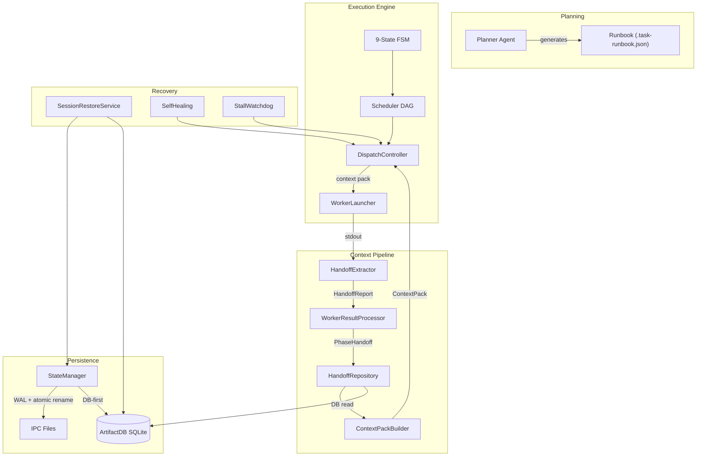
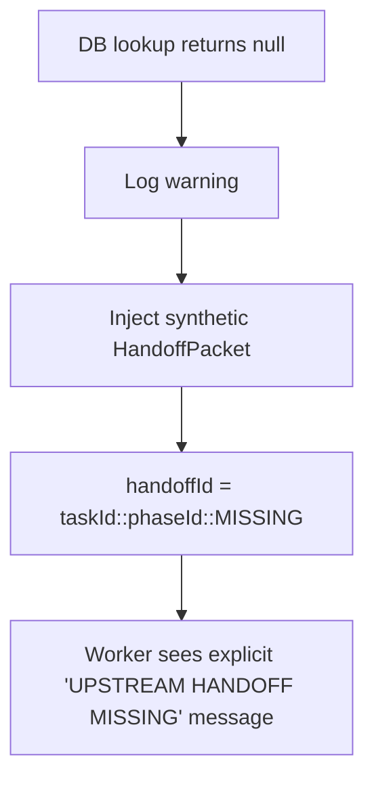
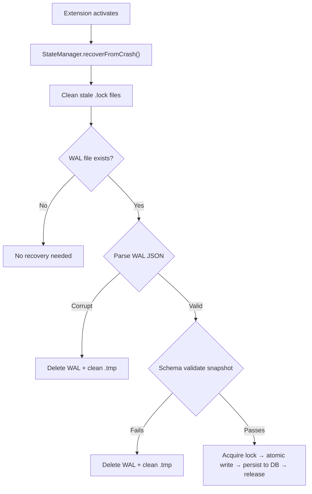

# Context Management Workflow

> **Audience**: Developers working on Coogent's multi-phase execution engine.
> **Last updated**: 2026-03-13

---

## System Overview

Coogent decomposes complex coding tasks into a **Directed Acyclic Graph (DAG)** of micro-tasks called **phases**. A central orchestrator (the **Engine**) drives a deterministic **9-state finite state machine (FSM)** that coordinates planning, worker dispatch, evaluation, and error recovery.

Context management is the critical subsystem ensuring each worker agent receives the right information from upstream phases without exceeding LLM token budgets. It follows an **ETSL pattern**:

| Step | Component | Responsibility |
|------|-----------|----------------|
| **Extract** | `HandoffExtractor` | Parse structured JSON from worker stdout via Zod validation |
| **Transform** | `WorkerResultProcessor` | Redact secrets, attach sentinel error codes, enrich metadata |
| **Store** | `HandoffRepository` | Transactional SQLite upsert (`BEGIN/COMMIT/ROLLBACK`) |
| **Load** | `ContextPackBuilder` | DB-first read → typed `HandoffPacket` → budget-aware assembly |

### Component Map



---

## Lifecycle & Data Flow

### Engine FSM States

```
IDLE ──PLAN_REQUEST──► PLANNING ──PLAN_GENERATED──► PLAN_REVIEW
                                                        │
                                          PLAN_APPROVED  │  PLAN_REJECTED (loop)
                                                        ▼
                                                    PARSING
                                                        │
                                             PARSE_SUCCESS
                                                        ▼
                                                     READY
                                                        │
                                                      START
                                                        ▼
                                              EXECUTING_WORKER ◄── Retry/Resume
                                                        │
                                              WORKER_EXITED
                                                        ▼
                                                   EVALUATING
                                                   /        \
                                        PHASE_FAIL            ALL_PHASES_PASS
                                             ▼                        ▼
                                       ERROR_PAUSED              COMPLETED
```

### Phase A → Phase B Handoff Sequence

```
Phase A Worker           WorkerResultProcessor          HandoffExtractor
─────────────            ─────────────────────          ────────────────
  │                             │                             │
  │  Worker exits (code 0)      │                             │
  ├────────────────────────────►│                             │
  │                             │  extractHandoff(id, stdout) │
  │                             ├────────────────────────────►│
  │                             │                             │ 1. parseHandoffJson()
  │                             │                             │    └ Fenced ```json (last match)
  │                             │                             │    └ Fallback: brace-counting
  │                             │                             │ 2. Zod safeParse()
  │                             │                             │ 3. SecretsGuard.redact()
  │                             │       HandoffReport         │
  │                             │◄────────────────────────────┤
  │                             │                             │
  │                             │  submitPhaseHandoff() ──────┼──► HandoffRepository
  │                             │                             │    (transactional upsert)
  │                             │                             │
  │                             │  onWorkerExited() → FSM     │
  │                             │                             │

                           DispatchController           ContextPackBuilder
                           ──────────────────           ──────────────────
                                  │                             │
                                  │  Phase B deps satisfied     │
                                  │  buildContextPack(phase)    │
                                  ├────────────────────────────►│
                                  │                             │ Step 1: Collect handoffs (DB)
                                  │                             │ Step 2: Identify target files
                                  │                             │ Step 3: Select file context mode
                                  │                             │ Step 4: Materialize file content
                                  │                             │ Step 5: Prune to token budget
                                  │                             │ Step 6: Build audit manifest
                                  │       ContextPack           │
                                  │◄────────────────────────────┤
                                  │                             │
                                  │  phase:execute ──► WorkerLauncher
```

### Handoff Extraction Heuristics

1. **Fenced JSON**: Regex `` ```json ... ``` `` — last match wins
2. **Balanced-brace fallback**: `extractBalancedJsonObjects()` — requires at least one discriminator key (`decisions`, `modified_files`, or `unresolved_issues`)
3. **Schema validation**: `HandoffJsonSchema.safeParse()` via Zod
4. **Sanitization**: All string fields pass through `SecretsGuard.redact()`
5. **Timestamping**: `Date.now()` branded as `UnixTimestampMs`

---

## State Schema

### HandoffReport *(extraction output)*

```typescript
// Produced by HandoffExtractor.extractHandoff()
interface HandoffReport {
    phaseId: number;
    decisions: string[];
    modified_files: string[];
    unresolved_issues: string[];
    next_steps_context: string;
    timestamp: number;                // Unix ms
    summary?: string;
    rationale?: string;
    remaining_work?: string[];
    constraints?: string[];
    warnings?: string[];
}
```

### PhaseHandoff *(persistence layer)*

```typescript
// Stored in HandoffRepository (SQLite)
interface PhaseHandoff {
    phaseId: string;                  // MCP phase ID ("phase-NNN-<uuid>")
    masterTaskId: string;             // Session directory name
    decisions: string[];
    modifiedFiles: string[];
    blockers: string[];               // Mapped from unresolved_issues
    completedAt: number;              // Unix ms
    nextStepsContext?: string;
    summary?: string;
    rationale?: string;
    remainingWork?: string[];
    constraints?: string[];
    warnings?: string[];
    changedFilesJson?: string;        // Stringified ChangedFileHandoff[]
    workspaceFolder?: string;
    symbolsTouched?: string[];
}
```

### HandoffPacket *(consumed by downstream phase)*

```typescript
// Built by ContextPackBuilder.phaseHandoffToPacket()
interface HandoffPacket {
    handoffId: string;                // "{taskId}::{phaseId}"
    sessionId: string;
    taskId: string;
    fromPhaseId: string;
    toPhaseIds?: string[];
    workspaceFolder?: string;
    summary: string;
    rationale?: string;
    remainingWork?: string[];
    constraints?: string[];
    warnings?: string[];
    repoState?: {
        baseCommit?: string;
        workingTree: 'clean' | 'patched' | 'unknown';
    };
    changedFiles: ChangedFileHandoff[];
    decisions?: string[];
    openQuestions?: string[];
    nextStepsContext?: string;
    producedAt: string;               // ISO-8601
}
```

### ContextPack *(assembled worker payload)*

```typescript
// Final payload injected into a worker agent
interface ContextPack {
    phaseId: string;
    workspaceFolder?: string;
    targetPrompt: string;
    handoffs: HandoffPacket[];
    fileContexts: FileContextEntry[]; // Discriminated union: full|slice|patch|metadata
    includedDependencies: Array<{
        workspaceFolder?: string;
        path: string;
        reason: string;
    }>;
    tokenUsage: {
        handoffs: number;
        files: number;
        dependencies: number;
        total: number;
        budget: number;
    };
}
```

### WALEntry *(crash recovery checkpoint)*

```typescript
interface WALEntry {
    readonly timestamp: UnixTimestampMs;
    readonly engineState: EngineState;
    readonly currentPhase: number;
    readonly snapshot: Runbook;
}
```

---

## Storage Mechanism

### Primary: ArtifactDB (SQLite)

| Table | Key | Content |
|-------|-----|---------|
| `tasks` | `master_task_id` | `runbook_json`, summary, execution plan |
| `phases` | `(master_task_id, phase_id)` | Phase metadata, logs |
| `handoffs` | `(master_task_id, phase_id)` | Serialized handoff data |
| `worker_outputs` | `(master_task_id, phase_id)` | Raw stdout + stderr |
| `context_manifests` | `manifest_id` | Full audit trail of context assembly decisions |

**Write path**: Transactional `BEGIN/COMMIT/ROLLBACK` with `ON CONFLICT DO UPDATE`.

### Secondary: IPC File System (crash-recovery fallback)

```
<storageUri>/ipc/<sessionId>/
├── .task-runbook.json     ← Atomic write (temp → rename)
├── .wal.json              ← Write-ahead log (cleared on success)
├── .lock                  ← File lock (PID-based, stale detection)
└── <phaseId>/
    └── response.md        ← Worker accumulated output
```

**Write sequence**: `mutex → file lock → WAL → temp write → atomic rename → clear WAL → unlock`

### In-Memory Cache

| Cache | Location | Purpose |
|-------|----------|---------|
| `cachedRunbook` | `StateManager` | Avoids disk I/O for runbook reads |
| `phaseIdMap` | `HandoffExtractor` | Numeric ID → MCP phase ID for DB lookups |

---

## Error Recovery

### 1. Missing Upstream Handoff

When `ContextPackBuilder.build()` cannot find a handoff for a declared dependency:



`HandoffExtractor.buildNextContext()` also emits actionable guidance when parent handoff is absent.

### 2. Worker Timeout / Crash

| Step | Action |
|------|--------|
| 1 | Flush accumulated stdout/stderr to DB (`upsertWorkerOutput`) |
| 2 | Best-effort partial `modified_files` extraction from accumulated output |
| 3 | Persist sentinel handoff with `WORKER_TIMEOUT` or `WORKER_CRASH` code |
| 4 | Write truncated `response.md` with `<!-- WORKER_TIMEOUT -->` header |
| 5 | FSM → `ERROR_PAUSED` via `onWorkerFailed()` |
| 6 | Broadcast warning to webview UI |

### 3. Handoff Extraction Failure

When `extractHandoff()` throws during an otherwise successful worker exit:

1. Sentinel handoff persisted with `HANDOFF_EXTRACTION_FAILED` code
2. Warning broadcast to webview — child phases may lack full parent context
3. FSM transition proceeds normally (phase still marked completed)

### 4. DB Deserialization Corruption

When `HandoffRepository.deserializeRow()` encounters unparseable JSON in core columns:

- Core fields default to `[]`
- Sentinel blocker injected: `HANDOFF_DESERIALIZATION_FAILED`
- Warning logged with `masterTaskId` and `phaseId` for forensics

### 5. Runbook Crash Recovery (WAL Replay)



### 6. Session Restore (Window Reload)

`SessionRestoreService` follows a 7-step error-accumulating flow:

1. Validate session health (`SessionHealthValidator`)
2. Resolve session directory
3. Create new `StateManager` + bind `ArtifactDB`
4. Switch engine session (FSM reset + runbook load)
5. Reconstruct MCP TaskState (summary, execution plan)
6. Collect worker outputs for UI hydration
7. Return structured `SessionRestoreResult`

> **Design choice**: Critical failures (health = `invalid`, engine switch throws) abort immediately. Non-critical failures (missing summary, no worker outputs) accumulate in `errors[]` — the restore still succeeds, maximizing diagnostic information.

### 7. Stall Detection

`DispatchController.stallWatchdog` runs every 30s:

| Condition | Recovery |
|-----------|----------|
| FSM = `EXECUTING_WORKER` but no running phases | Reset worker count → dispatch ready phases |
| All phases done (some failed) | → `ERROR_PAUSED` |
| All phases done (none failed) | → `COMPLETED` + `run:completed` |
| Pending phases with unsatisfied deps | Surface stall to UI → `ERROR_PAUSED` |

### 8. Token Budget Overrun

Multi-layer pruning cascade:

1. **ContextPackBuilder**: Drop `metadata` → `patch` entries from tail
2. **TokenPruner**: Drop discovered files → strip function bodies → truncate → degrade (`full` → `slice` → `metadata` → drop)
3. **ContextScoper**: Fall back from `ASTFileResolver` to `ExplicitFileResolver`

### Logging & Resume

All recovery paths produce structured logs via:
- `log.warn()`/`log.error()` — persistent filesystem logs
- `MissionControlPanel.broadcast()` — real-time webview notifications
- `TelemetryLogger.logBoundaryEvent()` — structured telemetry

Resume mechanisms:
- `PhaseController.restartPhase()` — reset and re-dispatch
- `DispatchController.resumePending()` — unblock `ERROR_PAUSED`
- `SelfHealing` — automatic retry with incremental context on evaluation failure
