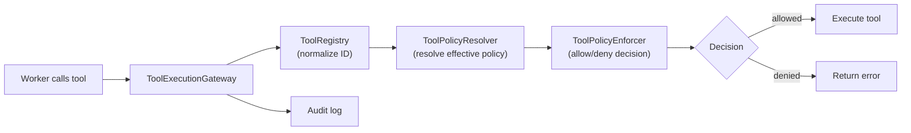
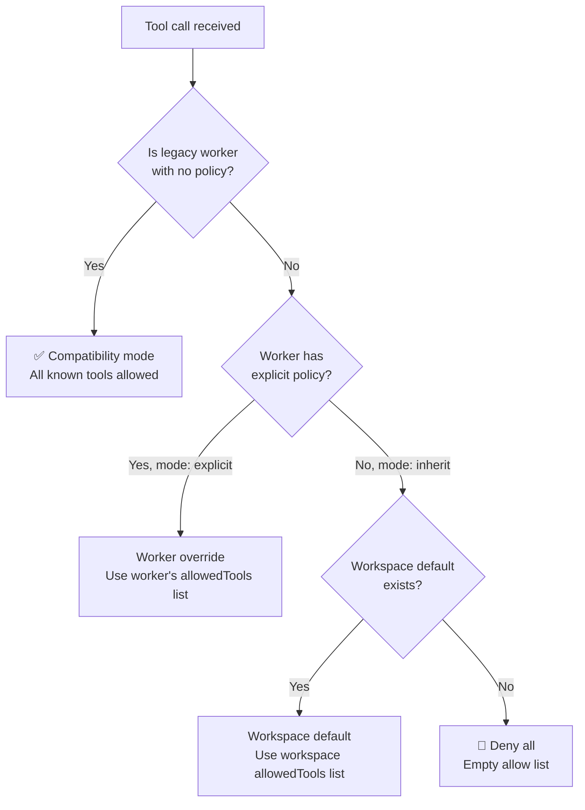

# Runtime Tool Policy Enforcement System

The runtime tool policy system controls which MCP tools each worker agent is allowed to invoke during task execution. It provides a layered policy resolution model with staged rollout support, allowing you to observe policy decisions before enforcing them.

---

## Architecture Overview



The system has **4 components**, each with a single responsibility:

| Component | File | Responsibility |
|-----------|------|----------------|
| **ToolRegistry** | `src/tool-policy/ToolRegistry.ts` | Canonical registry of known tool IDs. Maps raw names and aliases to canonical `<namespace>.<tool_name>` identifiers. |
| **ToolPolicyResolver** | `src/tool-policy/ToolPolicyResolver.ts` | Merges workspace defaults, worker overrides, and legacy compatibility rules into a single `ResolvedPolicy`. |
| **ToolPolicyEnforcer** | `src/tool-policy/ToolPolicyEnforcer.ts` | Pure, stateless evaluator. Checks a canonical tool ID against the resolved allow-list, respecting the enforcement mode. |
| **ToolExecutionGateway** | `src/tool-policy/ToolExecutionGateway.ts` | Orchestrator. Ties the above three into a single `evaluateInvocation()` call and produces audit log entries. |

---

## Registered Tools

The registry is seeded at construction with **7 built-in MCP tools** from `MCP_TOOLS`:

| Raw Name | Canonical ID |
|----------|-------------|
| `submit_execution_plan` | `coogent.submit_execution_plan` |
| `submit_phase_handoff` | `coogent.submit_phase_handoff` |
| `submit_consolidation_report` | `coogent.submit_consolidation_report` |
| `get_modified_file_content` | `coogent.get_modified_file_content` |
| `get_file_slice` | `coogent.get_file_slice` |
| `get_phase_handoff` | `coogent.get_phase_handoff` |
| `get_symbol_context` | `coogent.get_symbol_context` |

Both the raw name and the canonical ID resolve to the same canonical form, so either can be used in policy declarations.

### Registering Custom Tools

```typescript
import { ToolRegistry } from './tool-policy/index.js';

const registry = new ToolRegistry();
registry.register('plugin.my_custom_tool', ['my_custom_tool', 'myTool']);
// Now 'my_custom_tool', 'myTool', and 'plugin.my_custom_tool' all resolve
// to canonical ID 'plugin.my_custom_tool'
```

---

## Enforcement Modes

Controls how policy violations are handled. Designed for **staged rollout** — start with `observe`, graduate to `enforce`.

| Mode | Behavior | When to Use |
|------|----------|-------------|
| **`observe`** | Logs violations but **never blocks** any tool call. Denied tools are flagged with a `reason` in the decision. | Initial deployment. Monitor logs to understand which workers would be affected. |
| **`compatibility`** | Logs violations. Blocks workers with **explicit** policies. Allows legacy workers (no policy configured) full access under a grace period. | Transition phase. Lets new workers enforce while legacy workers keep working. |
| **`enforce`** | Blocks **all** policy violations. Workers without allowed tools get denied. | Full production enforcement after validating observe/compatibility logs. |

---

## Policy Resolution

When a tool call arrives, the `ToolPolicyResolver` determines the effective policy using this priority:



### Resolution Priority

1. **Legacy worker** (no policy configured) → compatibility mode (all tools allowed)
2. **Worker with `mode: explicit`** → use the worker's own `allowedTools` list
3. **Worker with `mode: inherit`** (or no policy) → use workspace default policy
4. **No workspace default, no worker policy** → deny all (safe default)

---

## Configuration

### Workspace Policy

The workspace-level policy sets defaults for all workers who don't override:

```typescript
const workspacePolicy: WorkspaceToolPolicy = {
    defaultPolicy: {
        mode: 'explicit',
        allowedTools: [
            'coogent.submit_execution_plan',
            'coogent.submit_phase_handoff',
            'coogent.get_file_slice',
            'coogent.get_modified_file_content',
            'coogent.get_phase_handoff',
            'coogent.get_symbol_context',
            'coogent.submit_consolidation_report',
        ],
    },
    enforcementMode: 'observe', // Start with observe, graduate to enforce
};
```

### Per-Worker Policy

Workers declare their policy through their `AgentProfile`:

```typescript
// In an AgentProfile definition
{
    // ... other profile fields ...
    allowed_tools_policy: {
        mode: 'explicit',                // 'explicit' or 'inherit'
        allowedTools: [
            'coogent.submit_phase_handoff',
            'coogent.get_file_slice',
            'coogent.get_modified_file_content',
        ],
    },
}
```

> [!NOTE]
> The legacy `allowed_tools: string[]` field is deprecated but still supported for backward compatibility. Use `allowed_tools_policy` for new configurations.

#### Mode Options

| Mode | Behavior |
|------|----------|
| `inherit` | Use the workspace default policy. The worker's `allowedTools` field is ignored. |
| `explicit` | Use the worker's own `allowedTools` list. Only tools in this list are permitted. |

---

## Integration Point

The gateway integrates into the MCP tool call pipeline via `MCPToolHandler`:

```typescript
// In MCPToolHandler.ts — called before every tool execution
if (this.gateway) {
    const ctx: ToolInvocationContext = {
        runId: 'unknown',
        sessionId: 'unknown',
        phaseId: 'unknown',
        workerId: 'unknown',
        requestedToolId: name,          // raw tool name from the request
    };
    const decision = await this.gateway.evaluateInvocation(ctx);
    if (!decision.allowed) {
        return { content: [{ type: 'text', text: `Denied: ${decision.reason}` }], isError: true };
    }
}
// ... proceed with tool execution
```

### Wiring the Gateway

```typescript
import { ToolRegistry, ToolPolicyResolver, ToolPolicyEnforcer, ToolExecutionGateway } from './tool-policy/index.js';

// 1. Create components
const registry  = new ToolRegistry();
const resolver  = new ToolPolicyResolver(registry);
const enforcer  = new ToolPolicyEnforcer();
const gateway   = new ToolExecutionGateway(registry, resolver, enforcer, workspacePolicy);

// 2. Attach to MCPToolHandler
mcpToolHandler.setGateway(gateway);

// 3. Update policy at runtime (e.g. from settings change)
gateway.setWorkspacePolicy(newPolicy);
```

---

## Audit Logging

Every tool invocation decision is logged with a `[ToolPolicy]` prefix:

```
[ToolPolicy] tool_policy.allowed: workerId=worker-1 toolId=coogent.get_file_slice policySource=workspace_default phaseId=phase-001
[ToolPolicy] tool_policy.denied:  workerId=worker-2 toolId=coogent.submit_execution_plan policySource=worker_override phaseId=phase-003 reason=...
```

### Audit Entry Structure

Each decision can be persisted as a `ToolPolicyAuditEntry`:

| Field | Type | Description |
|-------|------|-------------|
| `timestamp` | `number` | Unix timestamp (ms) |
| `eventType` | `ToolPolicyEventType` | `tool_policy.allowed` or `tool_policy.denied` |
| `runId` | `string` | Master task run identifier |
| `sessionId` | `string` | Session identifier |
| `phaseId` | `string` | Phase identifier |
| `workerId` | `string` | Worker agent identifier |
| `toolId` | `string` | Canonical tool ID |
| `policySource` | `string` | `workspace_default`, `worker_override`, or `compatibility_mode` |
| `decision` | `string` | `allowed` or `denied` |
| `denialReason` | `string?` | Reason for denial, if applicable |
| `correlationId` | `string` | Correlation ID for linking related events |

---

## Current Status

> [!IMPORTANT]
> The tool policy system is **fully implemented and tested** but currently runs in **observe-only mode** with the gateway not wired by default.

| Aspect | Status |
|--------|--------|
| Core components | ✅ Complete (4 classes, all tested) |
| Integration into `MCPToolHandler` | ✅ `setGateway()` API available |
| Default wiring | ⚠️ Gateway not attached by default — needs explicit setup |
| `useAgentSelection` flag | ⚠️ `false` by default in `EngineWiring.ts` |
| Enforcement mode | `observe` (no blocking) |

### Enabling Enforcement

To start enforcing tool policies:

1. **Wire the gateway** into `MCPToolHandler` by calling `setGateway()` during server initialization
2. **Set `enforcementMode`** to `'compatibility'` or `'enforce'` in the workspace policy
3. **Configure worker policies** via `allowed_tools_policy` in agent profiles
4. **Monitor logs** — look for `[ToolPolicy] tool_policy.denied` entries

---

## Source Files Reference

| File | Lines | Purpose |
|------|-------|---------|
| [`types.ts`](file:///Users/hoalee1806/workspaces/anti-ex/coogent/src/tool-policy/types.ts) | 143 | All type definitions |
| [`ToolRegistry.ts`](file:///Users/hoalee1806/workspaces/anti-ex/coogent/src/tool-policy/ToolRegistry.ts) | 124 | Canonical ID registry + alias resolution |
| [`ToolPolicyResolver.ts`](file:///Users/hoalee1806/workspaces/anti-ex/coogent/src/tool-policy/ToolPolicyResolver.ts) | 127 | Policy merge + resolution logic |
| [`ToolPolicyEnforcer.ts`](file:///Users/hoalee1806/workspaces/anti-ex/coogent/src/tool-policy/ToolPolicyEnforcer.ts) | 89 | Pure allow/deny evaluator |
| [`ToolExecutionGateway.ts`](file:///Users/hoalee1806/workspaces/anti-ex/coogent/src/tool-policy/ToolExecutionGateway.ts) | 103 | Orchestrator + audit logging |
| [`index.ts`](file:///Users/hoalee1806/workspaces/anti-ex/coogent/src/tool-policy/index.ts) | 22 | Public API exports |
| [`MCPToolHandler.ts`](file:///Users/hoalee1806/workspaces/anti-ex/coogent/src/mcp/MCPToolHandler.ts) | 191 | Integration point (gateway consumer) |
